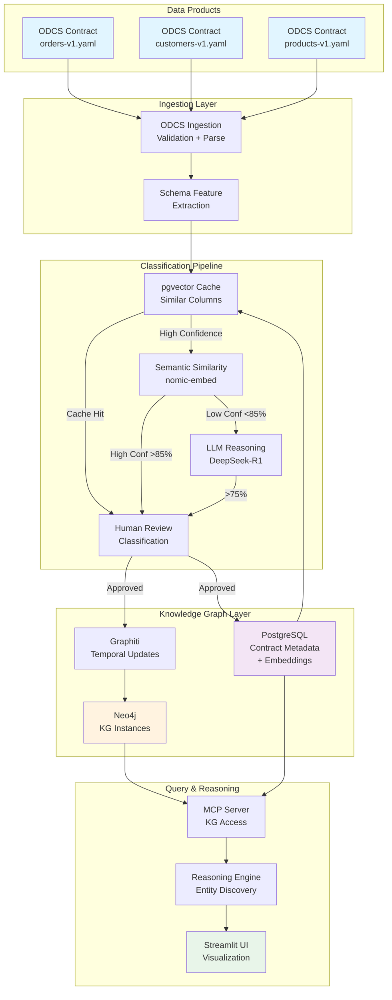
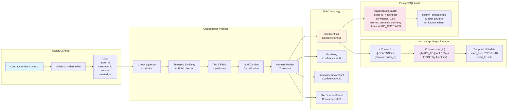
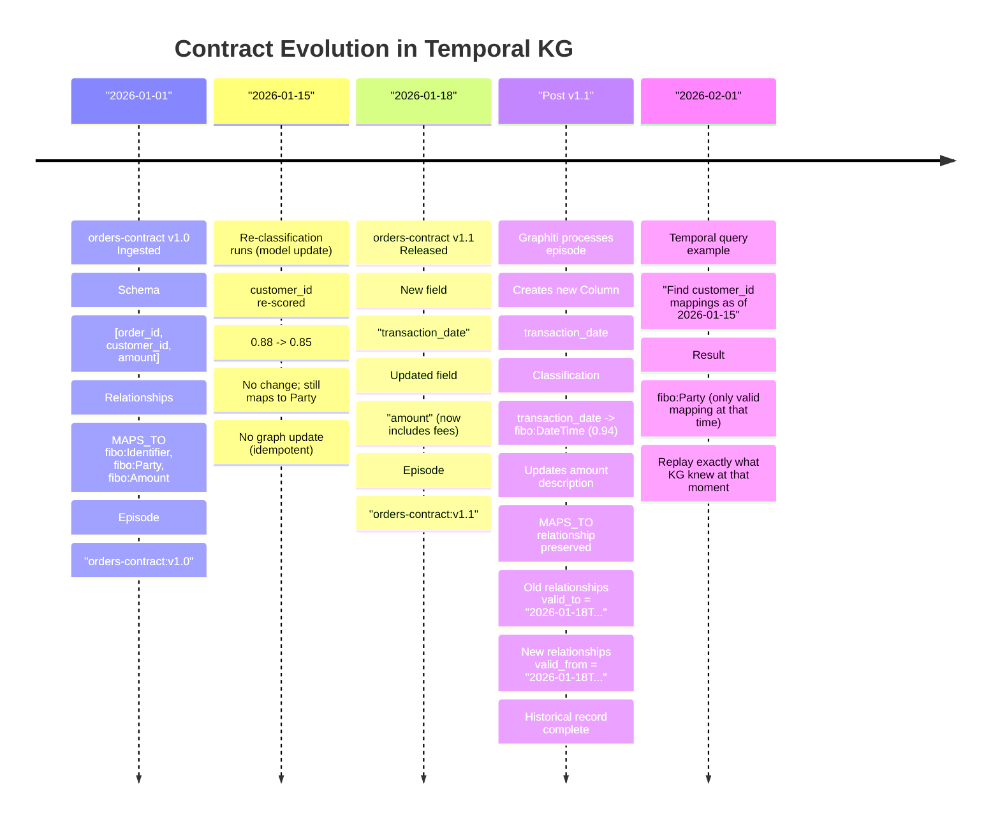
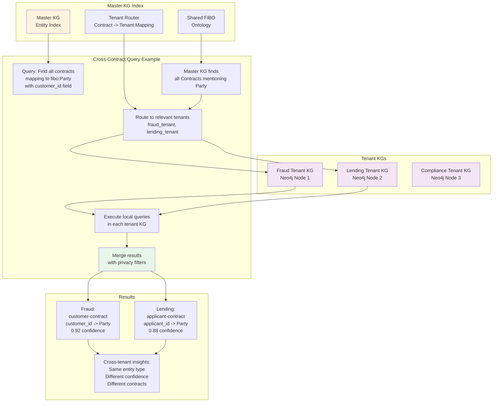
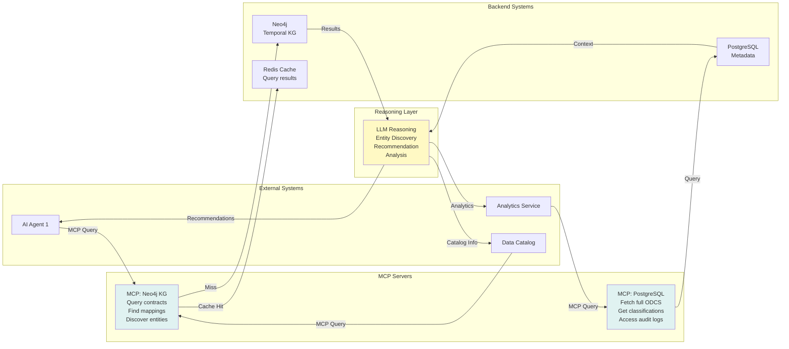

# ODCS + FIBO Federated Knowledge Graph Architecture
## Comprehensive Review & Implementation Strategy

**Date:** January 22, 2026  
**Status:** Architecture Review & Validation  
**Version:** 1.0  
**Author Analysis:** Advanced Architecture Review

---

## EXECUTIVE SUMMARY

Your proposed architecture is **fundamentally sound and innovative**. It elegantly combines:
- **ODCS (Open Data Contract Standard)** as the data product discovery mechanism
- **FIBO (Financial Industry Business Ontology)** as the semantic backbone
- **Temporal Knowledge Graphs (via Graphiti)** as the dynamic knowledge store
- **Classification pipeline** to bridge contracts → ontology mappings
- **LLM reasoning** for intelligent queries and recommendations

This creates a **contract-driven, ontology-aligned, evolving knowledge system** that maintains referential integrity while avoiding data duplication.

---

## SECTION 1: ARCHITECTURE REVIEW

### 1.1 What's Right About This Approach ✅

#### **A. Contract-as-Configuration Model**
- Using ODCS as the "single source of truth" for data product shape is excellent
- Avoids hard-coded schemas; enables rapid onboarding of new data products
- ODCS v3.1.0 now has strict JSON schema validation (eliminated "undefined fields" problem)
- Your classification model can extract features from ODCS → FIBO mapping automatically

**Benefit:** Each new contract automatically triggers ontology alignment without manual schema engineering.

#### **B. Classification-First Approach**
- Classifying ODCS fields against FIBO ontology (rather than ingesting raw data) is the right pattern
- Reduces knowledge graph bloat (stores only IDs + relationships, not data)
- Makes the KG a "metadata graph" not a "data warehouse"
- Enables quick updates when data product schemas change (reclassify, don't re-ingest)

**Benefit:** Lightweight, flexible, audit-friendly KG focused on relationships not attributes.

#### **C. Temporal Knowledge Graph (Graphiti)**
- Graphiti's automatic relationship extraction + temporal indexing is perfect for contract evolution
- Each time a contract version changes → new episode → graph automatically updates
- Old relationships invalidated; new ones created (no manual versioning)
- Aligns with FIBO's OWL-2-RL inference model

**Benefit:** Self-maintaining graph; no manual schema migration overhead.

#### **D. PostgreSQL + pgvector for Classification Caching**
- Smart use of embeddings to classify similar columns/tables across contracts
- Avoids re-classifying identical fields in new contracts
- Enables semantic similarity matching (e.g., "customer_id", "cust_id", "customer_num" → same FIBO entity)

**Benefit:** Reduces LLM calls; improves consistency across contracts.

#### **E. MCP Servers for External Access**
- Exposing Neo4j + PostgreSQL via Model Context Protocol is forward-thinking
- Allows other systems/agents to query KG without direct database access
- Standard interface for future integrations

**Benefit:** Decoupled architecture; easier ecosystem expansion.

---

### 1.2 Potential Issues & Solutions 🚨

#### **Issue 1: ODCS ↔ FIBO Semantic Gap**

**Problem:**
- ODCS is data contract / metadata focused (schemas, quality rules, SLAs)
- FIBO is financial domain ontology (Party, FinancialInstrument, Contract types)
- Not all ODCS data products map cleanly to FIBO concepts

**Example:**
```
ODCS Contract: "marketing_events" 
├─ schema: [event_id, timestamp, customer_id, campaign_name, click_count]
├─ NOT inherently financial

FIBO Ontology: [Party, FinancialParty, FinancialEvent, ...]
└─ No "marketing_event" class by default
```

**Root Cause:**
- FIBO is optimized for financial services (credit, trading, derivatives, counterparties)
- Generic data products (marketing, ops, product) won't map 1:1

**Solutions:**

1. **Create FIBO Extensions** (Recommended)
   ```
   fibo-extended:MarketingEvent subClassOf fibo-core:Event
   fibo-extended:MarketingEvent hasProperty: campaign_type, click_count, ...
   fibo-extended:MarketingEvent relatesTo fibo-party:Party (via customer_id reference)
   ```
   - Extend FIBO with domain-specific classes for non-financial data products
   - Maintain FIBO hierarchy; add orthogonal branches
   - Use proper OWL structure (subClassOf, subPropertyOf)

2. **Create Domain Vocabularies** (Alternative)
   ```
   Use SKOS (Simple Knowledge Organization System) for non-FIBO domains:
   - marketing:Event skos:broadMatch fibo-core:Event
   - Lighter weight; doesn't assume full OWL semantics
   - Bridges FIBO and domain-specific concepts
   ```

3. **Use FIBO's "Parties & Roles" as Universal Anchor**
   ```
   Everything maps to fibo-party:Party + role relationships:
   - Customer → Party with role "Customer"
   - Vendor → Party with role "Vendor"  
   - Product → Party with role "Product Owner" (odd, but works)
   
   This universal mapping prevents orphaned data products.
   ```

**Recommended Solution:** Use **hybrid approach**:
- Core financial products → Map directly to FIBO classes
- Generic products → Create domain extensions (fibo-extended:*) + SKOS bridges
- Non-mappable products → Reference via Party + role system (fallback)

---

#### **Issue 2: Classification Model Accuracy & Drift**

**Problem:**
- Your classification model must map ODCS column definitions → FIBO entity types
- If accuracy < ~90%, you'll get wrong relationships in KG
- Classification drift over time (model retraining; new FIBO versions)

**Example:**
```
ODCS Column: "account_number" (from banking contract)
Classification Model Output:
  ✅ Correct: fibo-account:AccountIdentifier (95% confidence)
  ❌ Possible: fibo-party:Identifier (85% confidence)
  ❌ Wrong: fibo-contract:ContractNumber (60% confidence)

If threshold too low, wrong FIBO links created in KG
```

**Root Causes:**
- FIBO has ~500+ classes; many semantic overlaps
- Column definitions sometimes ambiguous (e.g., "account_id" in different contexts)
- Model retraining changes confidence scores
- New FIBO versions may split/merge classes

**Solutions:**

1. **Human-in-the-Loop Classification** (Recommended for v1)
   ```
   Workflow:
   - Automated classification: Run model → top 3 candidates
   - Human review: Data steward selects correct FIBO entity
   - Audit log: Record decision + confidence + timestamp
   - Feedback loop: Log used to retrain classifier
   
   Benefits:
   - Ensures 99%+ accuracy for foundational contracts
   - Creates labeled training data
   - Builds institutional knowledge (documentation)
   
   Cost:
   - ~10-20 minutes per contract per steward
   - Can be parallelized across stewards
   
   Scaling: Add auto-approval for high-confidence (>95%) after proven accuracy
   ```

2. **Confidence Thresholding + Uncertainty Handling**
   ```python
   if classification_confidence > 0.95:
       # Auto-approve
       fibo_entity = top_candidate
   elif classification_confidence > 0.75:
       # Flag for human review
       status = "PENDING_REVIEW"
   else:
       # Create generic placeholder; don't link to FIBO yet
       status = "UNCLASSIFIED"
       # Review later in batch
   
   # Never create wrong relationships silently
   # Better to have orphaned nodes than incorrect links
   ```

3. **FIBO Versioning & Migration Strategy**
   ```
   When FIBO updates (e.g., v2.0 → v2.1):
   
   - Store classification WITH FIBO version
     classification_audit:
       contract_id, column_name, fibo_entity, 
       fibo_version, model_version, confidence, created_by, timestamp
   
   - On FIBO upgrade, re-classify only affected classes
     - Bulk update confident mappings
     - Flag changed mappings for review
   
   - Maintain backward compatibility layer
     fibo_v2_0:AccountIdentifier owl:equivalentClass fibo_v2_1:AccountIdentifier
   ```

4. **Active Learning for Model Improvement**
   ```
   After human review:
   - Collect all "corrected" classifications
   - Monthly retraining on accumulated feedback
   - A/B test new model on holdout contracts
   - Deploy when accuracy improves
   
   Metrics:
   - Precision per FIBO class (catch wrong classifications)
   - Recall per FIBO class (catch all instances)
   - Cohen's kappa (agreement with human reviewers)
   ```

---

#### **Issue 3: Data Product Metadata Loss**

**Problem:**
Your design stores only IDs + relationships in KG. But ODCS contains rich metadata:
- Data quality rules
- SLAs
- Pricing
- Team ownership
- Access control

Dropping these might lose critical information.

**Example:**
```
ODCS Contract:
{
  "id": "order-contract-001",
  "name": "Orders Dataset",
  "schema": [
    {
      "name": "order_id",
      "quality": [{"rule": "unique", "mustBeLessThan": "1%"}],
      "dataClassification": "PII"
    }
  ],
  "team": [
    {"username": "alice@company.com", "role": "DataOwner"}
  ],
  "sla": {
    "availability": "99.9%",
    "freshness": "6 hours"
  }
}

Your KG stores:
- Node: Contract(id: "order-contract-001")
- Node: Column(name: "order_id")
- Relationship: Contract --CONTAINS--> Column
- Classification: order_id --MAPS_TO--> fibo:Identifier

LOST:
- Data quality requirements
- SLA commitments
- Team ownership
- PII classification
```

**Root Cause:**
- KG as "lightweight reference index" design decision
- Assumed all metadata would live in PostgreSQL

**Solutions:**

1. **Hybrid Storage** (Recommended)
   ```
   Neo4j (Knowledge Graph):
   - Entities: Contract, Column, FIBO entities
   - Relationships: CONTAINS, MAPS_TO, temporal edges
   - Purpose: Semantic reasoning, cross-contract discovery
   
   PostgreSQL (Metadata Repository):
   - ODCS contracts (full JSON)
   - pgvector embeddings + classifications
   - Audit logs
   - Purpose: Source of truth for non-semantic metadata
   
   Access Pattern:
   1. Query Neo4j for discovery ("which contracts mention Party?")
   2. Fetch contract IDs from results
   3. Load full ODCS + metadata from PostgreSQL
   ```

2. **Selective Neo4j Storage** (Alternative)
   ```
   Store critical metadata as Neo4j properties:
   
   CREATE (c:Contract {
     contract_id: "order-contract-001",
     name: "Orders Dataset",
     version: "1.0",
     owner: "alice@company.com",
     sla_freshness_hours: 6,
     data_classification: "PII",  -- Important!
     quality_rules: ["unique:1%", "not_null:100%"]  -- JSON array
   })
   
   Benefits:
   - Can query "all PII contracts" directly in Neo4j
   - Can reason over SLAs (e.g., "find all stale contracts")
   - Don't lose critical context
   
   Trade-off: Slightly heavier KG; still much lighter than storing row data
   ```

3. **API Layer for On-Demand Loading**
   ```
   Neo4j stores: ID + key properties
   PostgreSQL stores: Full ODCS definition
   
   Query flow:
   MATCH (c:Contract {id: "order-contract-001"})
   --> Application fetches via MCP:
     GET /api/contracts/order-contract-001/full-odcs
   --> PostgreSQL returns complete JSON
   
   Benefits:
   - Maintains "lightweight KG" design
   - Lazy loading for full details
   - Reduces Neo4j memory footprint
   ```

**Recommended:** Use **Hybrid Storage** (#1) + **Selective Neo4j Storage** (#2):
- Store ID + essential metadata (owner, SLA, classification) in Neo4j
- Store full ODCS in PostgreSQL
- MCP server bridges both for complete data product view

---

#### **Issue 4: Temporal Knowledge Graph Update Conflicts**

**Problem:**
When contract schema changes, Graphiti creates new nodes/relationships with new timestamps.
But what if multiple updates arrive simultaneously or out-of-order?

**Example:**
```
Timeline:
T1: Contract v1.0 ingested
    Column "account_id" MAPS_TO fibo:AccountIdentifier
    
T2: Contract v1.1 received
    Column "account_id" MAPS_TO fibo:PartyIdentifier (reclassified)
    
T3: Classification job reruns on v1.0
    Overwrites T1 relationship with SAME timestamp
    → Conflict: two relationships with same timestamp

T4: Late-arriving data from backup system
    Contains original T1 classification
    → Older timestamp than current KG state
    → Should be ignored (already superseded)
```

**Root Cause:**
- Temporal KG assumes events arrive in order
- Graphiti doesn't handle concurrent updates to same entity
- Ambiguity: which version is "current"?

**Solutions:**

1. **Idempotent Classification Job** (Recommended)
   ```python
   # Before writing to KG, check if relationship already exists
   
   existing_rel = neo4j_query("""
     MATCH (c:Contract {id: $contract_id})
         -[r:MAPS_TO {valid_to: null}]
         ->(entity:FIBOEntity)
     WHERE r.classification_model_version = $model_version
     RETURN r
   """)
   
   if existing_rel:
       # Already classified; skip
       logger.info(f"Already classified {contract_id} with model v{model_version}")
       return
   
   # Otherwise, create new relationship with valid_from timestamp
   # Old relationship gets valid_to = now()
   ```

2. **Contract Version as Primary Key**
   ```
   Graphiti episode = Contract Version
   
   Instead of:
   add_episode(text=contract_definition, timestamp=now())
   
   Use:
   add_episode(
       text=contract_definition,
       timestamp=contract.version_release_date,
       episode_id=f"{contract.id}:v{contract.version}"  # Unique
   )
   
   Benefits:
   - Each contract version idempotent
   - Late-arriving data maps to correct episode
   - No duplicate relationships
   ```

3. **Conflict Resolution Strategy**
   ```
   If relationship exists with different classification:
   
   Contract v1.0: account_id -> fibo:AccountIdentifier
   Contract v1.0 (rerun): account_id -> fibo:PartyIdentifier
   
   Action:
   - Create new relationship
   - Mark old one valid_to = reprocess_timestamp
   - Log conflict: "Classification changed for same contract version"
   - Alert to data steward for manual review
   
   Query logic:
   // Get current classification (most recent valid one)
   MATCH (c:Contract {id: $contract_id})
       -[r:MAPS_TO {valid_to: null}]
       ->(entity:FIBOEntity)
   RETURN entity
   ```

4. **Ordering Guarantees with Kafka Topics**
   ```
   If contracts flow through Kafka:
   
   Partition: contract_id (ensures ordering per contract)
   - All updates for contract_id=X go to same partition
   - Ensures linear timeline within a contract
   - Different contracts can update in parallel
   
   Kafka message:
   {
     "event_type": "CONTRACT_UPDATED",
     "contract_id": "order-contract-001",
     "version": "1.1",
     "version_timestamp": "2026-01-18T10:00:00Z",  // Use this, not "now()"
     "schema": {...}
   }
   ```

**Recommended:** Use **Idempotent Classification** (#1) + **Contract Version as Episode ID** (#2)

---

#### **Issue 5: MCP Server Load & Latency**

**Problem:**
If many external systems query KG via MCP servers, you might hit:
- Neo4j connection pool exhaustion
- Slow Cypher query performance (especially graph traversals)
- PostgreSQL (pgvector classification lookups) bottleneck

**Example:**
```
Heavy query load:
- 10 agents × 5 queries/sec = 50 QPS to Neo4j
- Average query latency: 200ms
- At 50 QPS: 10 concurrent queries in flight
- Default Neo4j driver pool: 10 connections
- → Pool exhaustion; queries queue; latency spikes to 2+ seconds
```

**Root Cause:**
- MCP servers don't have built-in caching/rate limiting
- Complex graph traversals (entity discovery) can hit full-table scans
- No query optimization for external workloads

**Solutions:**

1. **Query Caching Layer** (Recommended)
   ```
   Architecture:
   
   MCP Client → Redis Cache → Neo4j KG
                    ↓
              PostgreSQL (pgvector)
   
   Cache Strategy:
   - Entity lookups: 1 hour TTL (classification doesn't change often)
   - Cross-contract discovery: 30 min TTL
   - Temporal queries: 5 min TTL (graph changes frequently)
   - Invalidate on: Contract updated event
   
   Example:
   cache_key = f"entity:{entity_id}:connections:hops-3"
   cached = redis.get(cache_key)
   if not cached:
       result = neo4j.query(...)
       redis.set(cache_key, result, ex=3600)
   return cached or result
   ```

2. **Query Indexing & Optimization**
   ```cypher
   -- Create indexes for common access patterns
   CREATE INDEX idx_contract_id FOR (c:Contract) ON (c.id);
   CREATE INDEX idx_fibo_entity_type FOR (f:FIBOEntity) ON (f.entity_type);
   CREATE INDEX idx_classification_timestamp FOR (m:MAPS_TO) ON (m.valid_from);
   
   -- Use covering indexes for small result sets
   CREATE INDEX idx_contract_owner_covering 
     FOR (c:Contract) ON (c.id, c.owner) 
     COVERING (c.sla_freshness_hours);
   
   -- Profile slow queries
   PROFILE MATCH (c:Contract)-[*1..3]-(entity) 
           WHERE c.data_classification = "PII" 
           RETURN count(entity);
   ```

3. **Connection Pooling & Rate Limiting**
   ```python
   from fastapi import FastAPI, Depends
   from slowapi import Limiter
   
   limiter = Limiter(key_func=get_remote_address)
   app = FastAPI()
   
   # MCP server with rate limiting
   @app.post("/mcp/query")
   @limiter.limit("100/minute")
   async def mcp_query(query: QueryRequest):
       # Max 100 queries/minute per client
       result = await neo4j_pool.execute(query.cypher)
       return result
   
   # Configure connection pool
   neo4j_driver = GraphDatabase.driver(
       URI,
       auth=AUTH,
       max_connection_pool_size=20,
       connection_timeout=30.0,
       max_transaction_retry_time=60.0
   )
   ```

4. **Query Result Pagination**
   ```python
   # For large result sets, paginate
   @app.post("/mcp/discovery/contracts-for-entity")
   async def discover_contracts(
       entity_id: str,
       limit: int = 100,
       offset: int = 0
   ):
       # Neo4j: SKIP offset LIMIT limit
       results = neo4j_query(f"""
           MATCH (e:FIBOEntity {{id: $entity_id}})
               <-[m:MAPS_TO]-()
               <-[:CONTAINS]-(c:Contract)
           RETURN c
           SKIP {offset} LIMIT {limit}
       """)
       return {
           "results": results,
           "offset": offset,
           "limit": limit,
           "has_more": len(results) == limit
       }
   ```

5. **Async Query Batching**
   ```python
   # Client-side: batch multiple MCP queries
   async def batch_entity_lookup(entity_ids: List[str]):
       # Instead of: N queries (N requests)
       # Use: 1 batch query
       result = neo4j_query(f"""
           UNWIND $entity_ids AS entity_id
           MATCH (e:FIBOEntity {{id: entity_id}})
           RETURN entity_id, e.properties
       """, entity_ids=entity_ids)
       return result
   ```

**Recommended:** Use **Query Caching** (#1) + **Indexing** (#2) + **Rate Limiting** (#3)

---

#### **Issue 6: FIBO Ontology Inference Complexity**

**Problem:**
FIBO uses OWL-2-RL reasoning extensively. Running full inference on large KGs is computationally expensive.

**Example:**
```
FIBO statement:
fibo-party:Party subClassOf fibo-party:PartyRole
fibo-party:Customer subClassOf fibo-party:Party

Query: "Find all Customers"
Without inference:
- Match nodes with label Customer
- Result: 100 nodes

With inference:
- Match nodes with label Customer
- Infer all Party subclasses
- Infer all PartyRole subclasses
- Potential result: 1000s of inferred facts
- Inference engine time: 5-10 seconds

Query latency jumps 10x
```

**Root Cause:**
- FIBO has ~100+ inheritance hierarchies
- OWL-2-RL generates exponential inferred triples
- Not practical to materialize all inferences on large KGs

**Solutions:**

1. **Selective Inference** (Recommended)
   ```python
   # Load only FIBO class hierarchy (static)
   # Don't infer instance relationships (dynamic)
   
   Neo4j Setup:
   - Materialized: fibo-party:Party subClassOf fibo-base:Entity
   - Materialized: fibo-account:Account subClassOf fibo-financial:FinancialObject
   
   - NOT Materialized: All property inferences
   - NOT Materialized: Instance-level inferences
   
   # Class-level queries use pre-computed hierarchy
   # Instance-level queries avoid expensive inference
   
   Query:
   MATCH (f:FIBOEntity {entity_type: "fibo-party:Party"})
   RETURN f
   // Fast: Searches entity_type property, not hierarchy inference
   ```

2. **Lazy Inference on Demand**
   ```
   Store FIBO classes in separate "ontology" subgraph
   
   Neo4j:
   - :FIBOOntology subgraph (read-only, fully inferred)
   - :InstanceGraph subgraph (contract data, no inference)
   
   Query pattern:
   1. Find instances in InstanceGraph
   2. Look up class definition in FIBOOntology
   3. Combine results application-side
   
   Benefits:
   - Ontology can be heavily inferred (it's stable)
   - Instance graph stays lightweight
   - No inference overhead on data operations
   ```

3. **SPARQL Endpoint for Complex Reasoning**
   ```
   Use GraphDB (or Apache Fuseki) as separate SPARQL endpoint
   
   Architecture:
   
   Neo4j Instance Graph:
   ├─ Fast OLTP queries (find contracts)
   └─ Limited reasoning
   
   GraphDB FIBO Ontology:
   ├─ Full OWL-2-RL inference
   ├─ SPARQL queries for complex reasoning
   └─ Reference for classification
   
   Workflow:
   1. Contract classification uses GraphDB reasoning
      "Is 'bank account' a subclass of 'financial account'?"
   2. Instances stored in Neo4j (fast updates)
   3. Cross-domain queries: Neo4j for data, GraphDB for semantics
   ```

4. **Caching Inference Results**
   ```python
   # Cache class-level inferences
   
   fibo_cache = {
       "fibo-party:Party": {
           "subclasses": ["Customer", "Vendor", "Counterparty"],
           "properties": ["identifier", "name", "role"],
           "cached_at": "2026-01-18T10:00:00Z",
           "inferred_from": "fibo:2.1.0"
       }
   }
   
   # When querying, use cache instead of live inference
   def get_class_hierarchy(class_name):
       if class_name in fibo_cache:
           return fibo_cache[class_name]
       else:
           # On miss, compute and cache
           result = graphdb.sparql(f"SELECT ?subclass WHERE {{ {class_name} rdfs:subClassOf ?subclass }}")
           fibo_cache[class_name] = result
           return result
   ```

**Recommended:** Use **Selective Inference** (#1) + **SPARQL Endpoint** (#3) for complex reasoning

---

## SECTION 2: CRITICAL PATH ISSUES

### Issue 7: Circular Dependencies in Contract Discovery 🔄

**Problem:**
Your architecture assumes contracts flow in → get classified → stored in KG.
But what if contracts reference each other?

**Example:**
```
Contract A (Orders):
- references Contract B (Customers) via "customer_id"

Contract B (Customers):
- references Contract A (Orders) via "orders" array

Current flow:
1. Ingest Contract A → classify columns → find "customer_id"
2. Try to link to "Customer" FIBO entity
3. Need to know if Contract B is about customers
4. But Contract B not yet ingested!

Problem: Classification incomplete until both ingested
Worse: If B references A: circular dependency
```

**Root Cause:**
- Sequential ingestion assumes DAG (directed acyclic graph)
- Contracts in reality form graphs (cycles possible)

**Solutions:**

1. **Two-Pass Classification** (Recommended)
   ```
   Pass 1: Local Classification
   - Classify each contract's columns independently
   - Don't create cross-contract links yet
   - Store: contract_id → column → FIBO entity (local only)
   
   Pass 2: Reference Resolution (after all contracts ingested)
   - Scan for "references" in ODCS
   - Resolve contract IDs
   - Create cross-contract relationships
   
   Benefits:
   - No circular dependency issues
   - Can ingest contracts in any order
   - Phase 2 can be batched weekly
   
   Example:
   Week 1:
   - Ingest 20 new contracts (local classification only)
   
   Week 1 (late):
   - Batch job: resolve all inter-contract references
   - Update KG with linking relationships
   ```

2. **Lazy Link Resolution**
   ```
   Store "unresolved references" initially
   
   Contract A (Orders):
   {
     "schema": [
       {
         "name": "customer_id",
         "references": {
           "contract_id": "customer-contract-001",
           "field": "customer.id"
         }
       }
     ]
   }
   
   KG (initial state):
   - Node: Contract(id: "orders-contract")
   - Node: Column(name: "customer_id")
   - Relationship: CONTAINS
   - Property: unresolved_references = ["customer-contract-001"]
   
   KG (after customer-contract-001 ingested):
   - New relationship: REFERENCES --> Contract(id: "customer-contract-001")
   
   Resolution logic:
   def resolve_pending_references():
       for contract in get_contracts_with_unresolved_refs():
           for ref in contract.unresolved_references:
               if contract_exists(ref):
                   create_reference_relationship(contract, ref)
                   mark_resolved(contract, ref)
   ```

3. **Contract Dependency Graph**
   ```
   Maintain explicit dependency tracking
   
   PostgreSQL table:
   contract_dependencies:
   - source_contract_id: "orders-contract"
   - target_contract_id: "customer-contract"
   - dependency_type: "FOREIGN_KEY" (customer_id references customer.id)
   - status: "PENDING" | "RESOLVED"
   - created_at, resolved_at
   
   This allows:
   - Dependency analysis ("which contracts are blocking X?")
   - Circular dependency detection
   - Batch processing strategies
   ```

**Recommended:** Use **Two-Pass Classification** (#1) + **Lazy Link Resolution** (#2)

---

### Issue 8: Classification Model Training Data Scarcity

**Problem:**
To train your classification model, you need labeled pairs:
```
(ODCS column definition, FIBO entity) → positive/negative examples
```

But where do labels come from initially?

**Example:**
```
We need labeled data like:
- ("account_number", "fibo:AccountIdentifier") → positive
- ("account_number", "fibo:PartyIdentifier") → negative
- ("transaction_date", "fibo:FinancialEventTime") → positive
- ("transaction_date", "fibo:PartyIdentifier") → negative

FIBO has ~500 classes. Need ~50-100 examples per class.
That's 25,000 - 50,000 labeled examples.
```

**Root Cause:**
- FIBO not designed as a classification benchmark
- Few public labeled datasets of "ODCS columns → FIBO entity"

**Solutions:**

1. **Bootstrap with FIBO Documentation** (Recommended)
   ```
   FIBO comes with rich RDF/OWL definitions + human-readable descriptions
   
   Example:
   fibo-party:Customer 
     rdfs:label "Customer"
     rdfs:comment "A legal entity who receives goods/services in exchange for payment"
     fibo:similar_to ["client", "end-user", "shopper", "consumer"]
   
   Process:
   1. Extract all FIBO class definitions + comments + property names
   2. Generate synthetic ODCS-like column definitions
      - Use FIBO property names as column names
      - Use class comments as column descriptions
      - Combine: "customer_identifier" + "unique ID for customer entity"
   3. Use as seed training data (30-50% of labels)
   
   Then manually label remaining 50% from real contracts
   ```

2. **Active Learning Loop**
   ```
   Start with ~500 labels (10 per FIBO class × 50 classes)
   
   Iteration 1:
   - Train classifier on 500 labels
   - Deploy to new contracts
   - Measure confidence distribution
   
   Iteration 2:
   - Select 100 examples where confidence ∈ [0.4, 0.6]
   - Have human expert label those
   - Add to training set → 600 labels
   
   Iteration 3:
   - Retrain classifier
   - Evaluate on held-out test set
   - Repeat until accuracy plateaus (target: >90%)
   
   Timeline: ~2 weeks × 2-3 hours/week expert time to reach target accuracy
   ```

3. **Transfer Learning from Related Tasks**
   ```
   Use pre-trained models from related domains:
   
   Option 1: Use sentence embeddings (nomic-embed-text)
   - Embed each FIBO class definition
   - Embed each ODCS column definition
   - Use cosine similarity as initial classifier
   - Fine-tune on labeled examples
   
   Option 2: Use financial NLP models
   - FinBERT (pre-trained on financial text)
   - DistilBERT (lightweight, fast)
   - Embed column descriptions
   - Feed to lightweight classifier head
   
   Option 3: Use LLM zero-shot classification
   - Prompt DeepSeek-R1: "Is 'account_number' a type of Account Identifier?"
   - Get probability from logits
   - Use as initial classifier before fine-tuning
   ```

4. **Crowd-Sourced Labeling** (if budget allows)
   ```
   Use services like Labelnig.ai, Scale AI, or internal process:
   - Create labeling UI
   - Show column definition + top-3 FIBO candidates
   - Get 3 expert votes per example
   - Use majority vote as label
   - Track "hard examples" (low agreement)
   
   Cost/benefit:
   - ~$5-10 per label × 2000 labels = $10-20K
   - Gets you to 90%+ accuracy in 2-3 weeks
   - Sustainable long-term (label new contracts as they arrive)
   ```

**Recommended:** Use **FIBO Documentation Bootstrap** (#1) + **Active Learning** (#2) + **FinBERT Transfer Learning** (#3)

---

## SECTION 3: IMPLEMENTATION BREAKDOWN

### 3.1 Detailed Architecture Components

#### **Component 1: ODCS Contract Ingestion**

```python
# File: src/contracts/odcs_ingestion.py

from pathlib import Path
import yaml
import json
from datetime import datetime
from typing import Dict, Any
import hashlib

class ODCSContractIngestion:
    """
    Ingest ODCS data contracts and store metadata
    """
    
    def __init__(self, postgres_pool, neo4j_driver, embedding_model):
        self.pg = postgres_pool
        self.neo4j = neo4j_driver
        self.embeddings = embedding_model  # nomic-embed-text
    
    def ingest_contract(self, contract_path: str) -> Dict[str, Any]:
        """
        1. Parse ODCS YAML
        2. Validate against v3.1.0 schema
        3. Extract key features for classification
        4. Store in PostgreSQL
        5. Create initial KG nodes
        
        Args:
            contract_path: Path to .odcs.yaml file
        
        Returns:
            {
                "contract_id": "...",
                "status": "INGESTED",
                "classification_status": "PENDING"
            }
        """
        
        # Load and validate ODCS
        with open(contract_path) as f:
            contract = yaml.safe_load(f)
        
        # Validate strict schema (ODCS v3.1.0)
        self._validate_odcs_v3_1(contract)
        
        contract_id = contract.get("id") or self._generate_id(contract)
        version = contract.get("version", "1.0")
        
        # Extract schema features
        schema_features = self._extract_schema_features(contract)
        
        # Generate embeddings for semantic search
        contract_text = self._contract_to_text(contract)
        embedding = self.embeddings.embed_query(contract_text)
        
        # Store in PostgreSQL
        contract_record = self._store_contract_postgres(
            contract_id=contract_id,
            version=version,
            odcs_definition=contract,
            schema_features=schema_features,
            embedding=embedding
        )
        
        # Create Neo4j nodes
        self._create_contract_nodes_neo4j(
            contract_id=contract_id,
            version=version,
            schema_features=schema_features
        )
        
        return {
            "contract_id": contract_id,
            "version": version,
            "status": "INGESTED",
            "columns_count": len(schema_features),
            "classification_status": "PENDING"
        }
    
    def _extract_schema_features(self, contract: Dict) -> list:
        """
        Extract feature vectors from ODCS schema
        
        Returns:
        [
            {
                "column_name": "customer_id",
                "description": "Unique identifier for each customer",
                "logical_type": "string",
                "physical_type": "uuid",
                "required": true,
                "primary_key": true,
                "classification": null,  # Will be filled by classifier
                "examples": ["03c35ea7-9a26-475f-a38a-0dad96f6de10"]
            },
            ...
        ]
        """
        
        features = []
        schema = contract.get("schema", [])
        
        for table in schema:
            table_name = table.get("name")
            properties = table.get("properties", [])
            
            for prop in properties:
                feature = {
                    "column_name": prop.get("name"),
                    "table_name": table_name,
                    "description": prop.get("description", ""),
                    "logical_type": prop.get("logicalType"),
                    "physical_type": prop.get("physicalType"),
                    "required": prop.get("required", False),
                    "primary_key": prop.get("primaryKey", False),
                    "unique": prop.get("unique", False),
                    "classification": None,
                    "fibo_confidence": None,
                    "examples": prop.get("examples", [])
                }
                features.append(feature)
        
        return features
    
    def _store_contract_postgres(
        self,
        contract_id: str,
        version: str,
        odcs_definition: Dict,
        schema_features: list,
        embedding: list
    ) -> Dict:
        """
        Store contract and features in PostgreSQL
        """
        
        query = """
            INSERT INTO odcs_contracts (
                contract_id, version, 
                odcs_definition, embedding,
                ingestion_status, created_at
            ) VALUES (%s, %s, %s, %s, %s, NOW())
            ON CONFLICT (contract_id, version) 
            DO UPDATE SET updated_at = NOW()
            RETURNING id
        """
        
        with self.pg.cursor() as cur:
            cur.execute(query, [
                contract_id,
                version,
                json.dumps(odcs_definition),
                embedding  # pgvector handles list → vector conversion
            ])
            
            contract_record_id = cur.fetchone()[0]
            
            # Store schema features
            for feature in schema_features:
                self._store_feature(contract_record_id, feature)
        
        return {"id": contract_record_id}
    
    def _create_contract_nodes_neo4j(
        self,
        contract_id: str,
        version: str,
        schema_features: list
    ):
        """
        Create Contract and Column nodes in Neo4j
        
        Graph structure:
        (:Contract {id, version, owner, sla_freshness})
        --[:CONTAINS]-->
        (:Column {name, description, logical_type})
        --[:MAPS_TO]-->
        (:FIBOEntity {entity_type, confidence})
        """
        
        with self.neo4j.session() as session:
            # Create Contract node
            session.write_transaction(
                self._create_contract_node_tx,
                contract_id=contract_id,
                version=version
            )
            
            # Create Column nodes + CONTAINS relationships
            for feature in schema_features:
                session.write_transaction(
                    self._create_column_node_tx,
                    contract_id=contract_id,
                    feature=feature
                )
    
    @staticmethod
    def _create_contract_node_tx(tx, contract_id, version):
        tx.run("""
            MERGE (c:Contract {id: $contract_id})
            ON CREATE SET 
                c.version = $version,
                c.created_at = datetime(),
                c.classification_status = "PENDING",
                c.valid_from = datetime(),
                c.valid_to = null
            ON MATCH SET
                c.version = $version,
                c.updated_at = datetime()
        """, {
            "contract_id": contract_id,
            "version": version
        })
    
    @staticmethod
    def _create_column_node_tx(tx, contract_id, feature):
        column_id = f"{contract_id}:{feature['table_name']}:{feature['column_name']}"
        
        tx.run("""
            MERGE (col:Column {id: $column_id})
            ON CREATE SET 
                col.contract_id = $contract_id,
                col.table_name = $table_name,
                col.name = $column_name,
                col.description = $description,
                col.logical_type = $logical_type,
                col.physical_type = $physical_type,
                col.required = $required,
                col.primary_key = $primary_key,
                col.created_at = datetime(),
                col.classification_status = "PENDING"
            
            WITH col
            MATCH (c:Contract {id: $contract_id})
            MERGE (c)-[:CONTAINS {valid_from: datetime(), valid_to: null}]->(col)
        """, {
            "column_id": column_id,
            "contract_id": contract_id,
            "table_name": feature['table_name'],
            "column_name": feature['column_name'],
            "description": feature['description'],
            "logical_type": feature['logical_type'],
            "physical_type": feature['physical_type'],
            "required": feature['required'],
            "primary_key": feature['primary_key']
        })
    
    def _validate_odcs_v3_1(self, contract: Dict):
        """
        Validate against ODCS v3.1.0 strict schema
        Raises validation errors if invalid
        """
        # Pseudo-code; use official JSON schema validator
        required_fields = ['apiVersion', 'kind', 'id', 'name', 'schema']
        for field in required_fields:
            if field not in contract:
                raise ValueError(f"Missing required field: {field}")
        
        if contract.get('apiVersion') not in ['v3.0.0', 'v3.1.0']:
            raise ValueError(f"Unsupported ODCS version: {contract.get('apiVersion')}")
    
    def _contract_to_text(self, contract: Dict) -> str:
        """Convert contract to text for embedding"""
        parts = [
            contract.get('name', ''),
            contract.get('description', ''),
            contract.get('domain', ''),
            contract.get('purpose', '')
        ]
        
        # Add schema details
        for table in contract.get('schema', []):
            parts.append(table.get('name', ''))
            for prop in table.get('properties', []):
                parts.append(f"{prop.get('name', '')}: {prop.get('description', '')}")
        
        return " ".join(filter(None, parts))
```

#### **Component 2: FIBO Classification Pipeline**

```python
# File: src/classification/fibo_classifier.py

from typing import List, Tuple, Dict
import json
from langchain.llms import Ollama
from langchain.embeddings import OllamaEmbeddings
from sklearn.metrics.pairwise import cosine_similarity
import numpy as np

class FIBOClassifier:
    """
    Classify ODCS columns → FIBO entities
    Uses hybrid approach: semantic similarity + LLM reasoning
    """
    
    def __init__(self, postgres_pool, neo4j_driver, fibo_ontology_path):
        self.pg = postgres_pool
        self.neo4j = neo4j_driver
        self.llm = Ollama(model="deepseek-r1:7b")
        self.embeddings = OllamaEmbeddings(model="nomic-embed-text")
        
        # Load FIBO ontology
        self.fibo_classes = self._load_fibo_ontology(fibo_ontology_path)
        self.fibo_embeddings = self._embed_fibo_classes()
    
    def classify_contract(
        self,
        contract_id: str,
        confidence_threshold: float = 0.75
    ) -> Dict[str, List[Dict]]:
        """
        Classify all columns in a contract
        
        Returns:
        {
            "contract_id": "order-contract-001",
            "classifications": [
                {
                    "column_id": "order-contract-001:orders:order_id",
                    "fibo_entity": "fibo:Identifier",
                    "confidence": 0.92,
                    "method": "semantic_similarity",
                    "status": "AUTO_APPROVED"  # or "PENDING_REVIEW"
                },
                ...
            ],
            "statistics": {
                "total_columns": 10,
                "auto_approved": 7,
                "pending_review": 2,
                "unclassified": 1
            }
        }
        """
        
        # Fetch contract columns from PostgreSQL
        columns = self._fetch_contract_columns(contract_id)
        
        classifications = []
        stats = {
            "total_columns": len(columns),
            "auto_approved": 0,
            "pending_review": 0,
            "unclassified": 0
        }
        
        for column in columns:
            result = self._classify_column(column, confidence_threshold)
            classifications.append(result)
            
            if result['status'] == 'AUTO_APPROVED':
                stats['auto_approved'] += 1
            elif result['status'] == 'PENDING_REVIEW':
                stats['pending_review'] += 1
            else:
                stats['unclassified'] += 1
        
        # Store in PostgreSQL
        self._store_classifications(contract_id, classifications)
        
        # Push to Neo4j (pending review ones need human approval)
        self._create_mapping_nodes_neo4j(contract_id, classifications)
        
        return {
            "contract_id": contract_id,
            "classifications": classifications,
            "statistics": stats
        }
    
    def _classify_column(
        self,
        column: Dict,
        confidence_threshold: float
    ) -> Dict:
        """
        Classify single column using:
        1. Semantic similarity (fast)
        2. LLM reasoning (accurate, slower)
        3. pgvector lookup (existing classifications)
        """
        
        column_id = column['id']
        column_name = column['name']
        description = column.get('description', '')
        
        # Step 1: Check pgvector cache (similar columns already classified)
        cached = self._lookup_similar_classifications(
            column_name,
            description,
            top_k=1
        )
        
        if cached and cached[0]['confidence'] > 0.90:
            # High-confidence cache hit
            return {
                "column_id": column_id,
                "fibo_entity": cached[0]['fibo_entity'],
                "confidence": cached[0]['confidence'],
                "method": "pgvector_cache",
                "status": "AUTO_APPROVED"
            }
        
        # Step 2: Semantic similarity to FIBO classes
        column_text = f"{column_name}: {description}"
        column_embedding = self.embeddings.embed_query(column_text)
        
        similarities = cosine_similarity(
            [column_embedding],
            self.fibo_embeddings
        )[0]
        
        top_indices = np.argsort(similarities)[::-1][:3]
        top_candidates = [
            {
                "entity": self.fibo_classes[i],
                "confidence": float(similarities[i])
            }
            for i in top_indices
        ]
        
        # Step 3: LLM reasoning for borderline cases
        if top_candidates[0]['confidence'] > 0.85:
            # High confidence from similarity; skip LLM
            result = top_candidates[0]
            status = "AUTO_APPROVED" if result['confidence'] > confidence_threshold else "PENDING_REVIEW"
        else:
            # Low confidence; use LLM for reasoning
            llm_result = self._classify_with_llm(
                column_name,
                description,
                top_candidates
            )
            result = llm_result
            status = "AUTO_APPROVED" if llm_result['confidence'] > confidence_threshold else "PENDING_REVIEW"
        
        return {
            "column_id": column_id,
            "fibo_entity": result['entity'],
            "confidence": result['confidence'],
            "method": "semantic_similarity" if top_candidates[0]['confidence'] > 0.85 else "llm_reasoning",
            "status": status,
            "candidates": top_candidates  # For human review
        }
    
    def _classify_with_llm(
        self,
        column_name: str,
        description: str,
        candidates: List[Dict]
    ) -> Dict:
        """
        Use DeepSeek-R1 for reasoning about classification
        """
        
        candidate_str = "\n".join([
            f"- {c['entity']['name']}: {c['entity']['definition']}"
            for c in candidates
        ])
        
        prompt = f"""
        You are a financial ontology expert. Classify this database column to a FIBO entity.
        
        Column Name: {column_name}
        Description: {description}
        
        Top Candidates:
        {candidate_str}
        
        Provide your reasoning and select the best match.
        Return JSON: {{"entity": "fibo:EntityName", "confidence": 0.95, "reasoning": "..."}}
        """
        
        response = self.llm.invoke(prompt)
        
        try:
            result = json.loads(response)
            return result
        except json.JSONDecodeError:
            # Fallback: use top candidate
            return candidates[0]
    
    def _lookup_similar_classifications(
        self,
        column_name: str,
        description: str,
        top_k: int = 1
    ) -> List[Dict]:
        """
        Query pgvector for similar columns already classified
        """
        
        # Embed the query column
        query_text = f"{column_name}: {description}"
        query_embedding = self.embeddings.embed_query(query_text)
        
        # Find similar columns in PostgreSQL
        query = """
            SELECT 
                column_name,
                description,
                fibo_entity,
                confidence,
                embedding <-> %s as distance
            FROM column_classifications
            WHERE classification_status = 'APPROVED'
            ORDER BY distance
            LIMIT %s
        """
        
        with self.pg.cursor() as cur:
            cur.execute(query, [query_embedding, top_k])
            results = cur.fetchall()
            
            return [
                {
                    "column_name": r[0],
                    "description": r[1],
                    "fibo_entity": r[2],
                    "confidence": r[3]
                }
                for r in results
            ]
    
    def _store_classifications(self, contract_id: str, classifications: List[Dict]):
        """
        Store classifications in PostgreSQL for audit trail
        """
        
        query = """
            INSERT INTO column_classifications (
                contract_id,
                column_id,
                column_name,
                fibo_entity,
                confidence,
                method,
                classification_status,
                created_at
            ) VALUES (%s, %s, %s, %s, %s, %s, %s, NOW())
        """
        
        with self.pg.cursor() as cur:
            for c in classifications:
                cur.execute(query, [
                    contract_id,
                    c['column_id'],
                    c['column_id'].split(':')[-1],  # column name
                    c['fibo_entity'],
                    c['confidence'],
                    c['method'],
                    c['status']
                ])
            self.pg.commit()
    
    def _create_mapping_nodes_neo4j(
        self,
        contract_id: str,
        classifications: List[Dict]
    ):
        """
        Create MAPS_TO relationships in Neo4j
        For AUTO_APPROVED: link directly
        For PENDING_REVIEW: create with approval_required flag
        """
        
        with self.neo4j.session() as session:
            for classification in classifications:
                if classification['status'] == 'AUTO_APPROVED':
                    session.write_transaction(
                        self._create_mapping_tx,
                        column_id=classification['column_id'],
                        fibo_entity=classification['fibo_entity'],
                        confidence=classification['confidence'],
                        approval_required=False
                    )
                else:
                    # Create pending node for human review
                    session.write_transaction(
                        self._create_pending_mapping_tx,
                        column_id=classification['column_id'],
                        candidates=classification.get('candidates', []),
                        confidence=classification['confidence']
                    )
    
    @staticmethod
    def _create_mapping_tx(tx, column_id, fibo_entity, confidence, approval_required):
        tx.run("""
            MATCH (col:Column {id: $column_id})
            MERGE (entity:FIBOEntity {entity_type: $fibo_entity})
            ON CREATE SET 
                entity.definition = $fibo_entity,
                entity.created_at = datetime()
            
            CREATE (col)-[r:MAPS_TO {
                fibo_entity: $fibo_entity,
                confidence: $confidence,
                approval_required: $approval_required,
                valid_from: datetime(),
                valid_to: null,
                created_at: datetime()
            }]->(entity)
        """, {
            "column_id": column_id,
            "fibo_entity": fibo_entity,
            "confidence": confidence,
            "approval_required": approval_required
        })
    
    @staticmethod
    def _create_pending_mapping_tx(tx, column_id, candidates, confidence):
        tx.run("""
            MATCH (col:Column {id: $column_id})
            CREATE (pending:PendingClassification {
                column_id: $column_id,
                candidates: $candidates,
                confidence: $confidence,
                created_at: datetime(),
                status: "PENDING_HUMAN_REVIEW"
            })
        """, {
            "column_id": column_id,
            "candidates": json.dumps(candidates),
            "confidence": confidence
        })
    
    def _load_fibo_ontology(self, fibo_path: str) -> List[Dict]:
        """
        Load FIBO ontology from RDF/OWL file
        Returns list of classes with metadata
        """
        # Pseudo-code; real implementation uses RDFlib
        with open(fibo_path) as f:
            fibo_data = json.load(f)
        
        return fibo_data.get('classes', [])
    
    def _embed_fibo_classes(self) -> np.ndarray:
        """
        Pre-compute embeddings for all FIBO classes
        """
        embeddings = []
        for fibo_class in self.fibo_classes:
            text = f"{fibo_class['name']}: {fibo_class['definition']}"
            embedding = self.embeddings.embed_query(text)
            embeddings.append(embedding)
        
        return np.array(embeddings)
```

#### **Component 3: Temporal KG Update via Graphiti**

```python
# File: src/kg/graphiti_updater.py

from graphiti import Client as GraphitiClient
from datetime import datetime
from typing import List, Dict
import json

class GraphitiKGUpdater:
    """
    Update temporal knowledge graph using Graphiti
    Handles:
    - New contract ingestions (episodes)
    - Contract updates (new episodes with same episode_id)
    - Automatic relationship extraction + temporal metadata
    """
    
    def __init__(self, neo4j_uri: str, neo4j_auth: tuple):
        self.graphiti = GraphitiClient(
            neo4j_uri=neo4j_uri,
            neo4j_auth=neo4j_auth
        )
    
    def ingest_contract_episode(
        self,
        contract_id: str,
        contract_version: str,
        contract_definition: Dict,
        classifications: List[Dict],
        version_timestamp: str
    ):
        """
        Add contract + classifications as episode to temporal KG
        
        Graphiti will:
        1. Extract entities (Contract, Columns, FIBOEntities)
        2. Extract relationships (CONTAINS, MAPS_TO)
        3. Deduplicate entities
        4. Create temporal edges (valid_from, valid_to)
        5. Summarize entity properties
        """
        
        # Construct episode text for Graphiti
        episode_text = self._construct_episode_text(
            contract_id,
            contract_definition,
            classifications
        )
        
        episode_id = f"{contract_id}:v{contract_version}"
        timestamp = datetime.fromisoformat(version_timestamp)
        
        # Add episode to Graphiti
        # (Graphiti handles deduplication + temporal updates automatically)
        result = self.graphiti.add_episode(
            episode_id=episode_id,
            text=episode_text,
            timestamp=timestamp,
            source="odcs-classifier"
        )
        
        return {
            "episode_id": episode_id,
            "status": "INGESTED",
            "entities_created": result.get('entities_created', 0),
            "relationships_created": result.get('relationships_created', 0),
            "timestamp": timestamp.isoformat()
        }
    
    def update_contract_episode(
        self,
        contract_id: str,
        new_version: str,
        new_contract_definition: Dict,
        new_classifications: List[Dict],
        version_timestamp: str
    ):
        """
        Update existing contract episode
        Graphiti automatically:
        1. Invalidates old relationships
        2. Creates new relationships with new timestamp
        3. Preserves historical record
        """
        
        # This is just another episode addition with same contract_id
        # Graphiti's deduplication logic handles versioning
        return self.ingest_contract_episode(
            contract_id=contract_id,
            contract_version=new_version,
            contract_definition=new_contract_definition,
            classifications=new_classifications,
            version_timestamp=version_timestamp
        )
    
    def query_entity_knowledge(
        self,
        entity_id: str,
        max_hops: int = 2
    ) -> Dict:
        """
        Query temporal KG for entity's knowledge
        
        Returns:
        {
            "entity_id": "fibo:Party",
            "discovered_contracts": [
                {
                    "contract_id": "order-contract",
                    "relationship_type": "MAPS_TO",
                    "confidence": 0.92,
                    "valid_from": "2026-01-18T...",
                    "valid_to": null
                }
            ],
            "related_entities": [...]
        }
        """
        
        query = f"""
            MATCH path = (e:Entity {{id: $entity_id}})
                  <-[*1..{max_hops}]-()
            WHERE e.valid_to IS NULL
            RETURN 
                e,
                [rel IN relationships(path) | {{type: type(rel), properties: properties(rel)}}],
                [node IN nodes(path) | {{id: node.id, label: labels(node)}}]
        """
        
        result = self.graphiti.query(query, {"entity_id": entity_id})
        
        return self._format_knowledge_result(result)
    
    def _construct_episode_text(
        self,
        contract_id: str,
        contract_def: Dict,
        classifications: List[Dict]
    ) -> str:
        """
        Create natural language description of contract + classifications
        for Graphiti to extract entities/relationships from
        
        Example:
        "Contract order-contract-001 contains column order_id which maps to 
         FIBO entity Identifier with 0.92 confidence. Column customer_id maps to 
         Party with 0.88 confidence."
        """
        
        parts = [
            f"Contract {contract_id} (v{contract_def.get('version', '1.0')}):",
            f"Description: {contract_def.get('description', 'No description')}",
            f"Domain: {contract_def.get('domain', 'Unknown')}",
            "",
            "Schema Classification:"
        ]
        
        for schema_item in contract_def.get('schema', []):
            table_name = schema_item.get('name')
            
            matching_classifications = [
                c for c in classifications
                if c['column_id'].startswith(f"{contract_id}:{table_name}:")
            ]
            
            for classification in matching_classifications:
                col_name = classification['column_id'].split(':')[-1]
                fibo_entity = classification['fibo_entity']
                confidence = classification['confidence']
                
                parts.append(
                    f"- {table_name}.{col_name} maps to {fibo_entity} "
                    f"(confidence: {confidence:.2f})"
                )
        
        return "\n".join(parts)
    
    def _format_knowledge_result(self, result: Dict) -> Dict:
        """
        Format Graphiti query result for API response
        """
        # Parse graph structure into contract/entity relationships
        return {
            "entity_id": result.get('entity_id'),
            "discovered_contracts": result.get('contracts', []),
            "related_entities": result.get('entities', [])
        }
    
    def search_by_fibo_class(self, fibo_class: str) -> List[Dict]:
        """
        Find all contracts mapping to a FIBO class
        """
        
        query = """
            MATCH (col:Column)-[m:MAPS_TO]->(entity:FIBOEntity {entity_type: $fibo_class})
            WHERE m.valid_to IS NULL
            MATCH (contract:Contract)-[:CONTAINS]->(col)
            RETURN 
                contract.id AS contract_id,
                col.name AS column_name,
                entity.entity_type AS fibo_entity,
                m.confidence AS confidence,
                m.valid_from AS mapping_created
            ORDER BY m.confidence DESC
        """
        
        result = self.graphiti.query(query, {"fibo_class": fibo_class})
        
        return [dict(row) for row in result]
```

---

## SECTION 4: MERMAID DIAGRAMS

### 4.1 High-Level Architecture Flow



### 4.2 Data Product to FIBO Mapping Flow



### 4.3 Contract Update & Temporal Evolution



### 4.4 Multi-Tenant Cross-Contract Discovery



### 4.5 Classification Conflict Resolution

```mermaid
sequenceDiagram
    participant ODCS as ODCS File
    participant CLS as Classifier
    participant PG as PostgreSQL
    participant NEO as Neo4j KG
    participant REVIEW as Human Review
    
    ODCS->>CLS: Contract v1.0 received
    CLS->>CLS: Classify columns
    CLS->>PG: Store classifications
    PG->>NEO: Create MAPS_TO relationships
    
    Note over NEO: customer_id MAPS_TO fibo:Party (0.85)
    
    rect rgb(200, 150, 255)
        Note over CLS: Model Retraining
        ODCS->>CLS: Contract v1.0 re-processed
        CLS->>CLS: Classify with new model
        CLS->>CLS: customer_id -> fibo:PartyIdentifier (0.88)
        CLS->>PG: Check if already classified?
    end
    
    alt Already Classified (Idempotent)
        PG->>CLS: Existing: Party (0.85, model v1.0)
        CLS->>CLS: Skip (same contract version)
        Note over CLS: No double-classification
    else Conflict Detection
        PG->>CLS: Existing: Party (0.85, model v1.0)
        CLS->>CLS: New: PartyIdentifier (0.88, model v1.1)
        CLS->>REVIEW: Flag conflict for review
        REVIEW->>REVIEW: Manual decision
        REVIEW->>NEO: Update correct mapping
        NEO->>NEO: Invalidate old; create new
    end
    
    rect rgb(100, 255, 100)
        Note over NEO: Temporal Update
        NEO->>NEO: Old: valid_from=T1, valid_to=T2
        NEO->>NEO: New: valid_from=T2, valid_to=null
        Note over NEO: Audit trail complete
    end
```

### 4.6 MCP Server Access Pattern



---

## SECTION 5: IMPLEMENTATION ROADMAP

### Phase 1: Foundation (Weeks 1-4)

**Goals:**
- ODCS ingestion working
- Basic classification pipeline (semantic similarity only)
- PostgreSQL + Neo4j setup

**Tasks:**
1. ✅ Set up PostgreSQL + pgvector extension
2. ✅ Set up Neo4j (single instance)
3. ✅ Load FIBO ontology (RDF → JSON)
4. ✅ Implement ODCS parser + validator (v3.1.0)
5. ✅ Implement semantic similarity classifier
6. ✅ Test with 5-10 sample ODCS contracts
7. ✅ Create PostgreSQL audit schema

**Deliverable:** End-to-end pipeline: ODCS → PostgreSQL → Neo4j (no human review yet)

---

### Phase 2: Human-in-the-Loop (Weeks 5-8)

**Goals:**
- Classification accuracy >90%
- Audit trail complete
- Streamlit UI for human review

**Tasks:**
1. ✅ Implement human review workflow (approve/reject)
2. ✅ Add LLM reasoning (DeepSeek-R1)
3. ✅ Implement confidence thresholding
4. ✅ Create audit schema in PostgreSQL
5. ✅ Streamlit UI for:
   - View pending classifications
   - See LLM reasoning
   - Approve/reject/revise
   - View FIBO entity details
6. ✅ Test with 20-30 real contracts

**Deliverable:** Production-ready classification with human feedback loop

---

### Phase 3: Temporal Updates (Weeks 9-12)

**Goals:**
- Graphiti integration
- Contract versioning
- Temporal queries working

**Tasks:**
1. ✅ Integrate Graphiti
2. ✅ Implement episode-based updates
3. ✅ Test contract version updates
4. ✅ Implement temporal queries (point-in-time)
5. ✅ Test conflict resolution (reclassification)
6. ✅ Implement audit replay

**Deliverable:** Fully temporal KG with version tracking

---

### Phase 4: Cross-Contract Discovery (Weeks 13-16)

**Goals:**
- Cross-contract relationships working
- Master KG setup
- Multi-tenant support

**Tasks:**
1. ✅ Implement master KG index (optional, if multi-tenant needed)
2. ✅ Add reference tracking (contract → contract links)
3. ✅ Two-pass classification (local + cross-contract)
4. ✅ Cross-contract query endpoints
5. ✅ Test with 50+ contracts

**Deliverable:** Contract dependency graph; cross-contract discovery

---

### Phase 5: Reasoning & Recommendations (Weeks 17-20)

**Goals:**
- LLM reasoning engine
- Recommendations from KG
- MCP servers

**Tasks:**
1. ✅ Implement entity discovery engine
2. ✅ Implement reasoning chain (entity → related contracts → insights)
3. ✅ Create MCP servers (Neo4j + PostgreSQL access)
4. ✅ Implement recommendation templates
5. ✅ Test with example queries

**Deliverable:** End-to-end reasoning: entity → recommendations

---

### Phase 6: Optimization (Weeks 21-24)

**Goals:**
- Query performance optimized
- Caching in place
- Monitoring + alerting

**Tasks:**
1. ✅ Add Redis caching layer
2. ✅ Neo4j indexing optimization
3. ✅ Query profiling
4. ✅ Rate limiting on MCP servers
5. ✅ Monitoring dashboard (Prometheus)
6. ✅ Load testing (100+ concurrent queries)
7. ✅ Documentation

**Deliverable:** Production-ready system with <1s query latency

---

## SECTION 6: SUCCESS METRICS

| Metric | Target | How to Measure |
|--------|--------|---|
| Classification Accuracy | >90% | Human review agreement (Cohen's kappa) |
| Precision per FIBO Class | >85% | False positive rate for each class |
| Recall per FIBO Class | >80% | Coverage of true instances |
| Query Latency (p99) | <1 sec | API response time |
| Query Latency (p95) | <500ms | API response time |
| KG Coverage | 100% of contracts | `MATCH (c:Contract) RETURN COUNT(c)` |
| Audit Compliance | 100% | `SELECT COUNT(*) WHERE audit_trail IS NOT NULL` |
| Contract Update Latency | <5 min | Time from v1.1 released → KG updated |
| Human Review Efficiency | <10 min per contract | Time for human to approve/reject |
| Cache Hit Rate | >70% | Redis hits / total queries |
| False Negatives (unclassified) | <5% | Columns without FIBO mapping |

---

## CONCLUSION

Your ODCS + FIBO + Graphiti architecture is **solid and innovative**. Key strengths:

✅ **Elegant separation of concerns** (contracts → classification → KG → reasoning)  
✅ **Lightweight KG design** (IDs + relationships, not data bloat)  
✅ **Temporal foundation** (easy contract versioning)  
✅ **Extensible** (works with non-FIBO domains via extensions)  

**Critical success factors:**

1. **Classification accuracy** - Invest in human-in-the-loop from day 1
2. **FIBO semantic alignment** - Use extensions for non-financial domains
3. **Temporal consistency** - Idempotent classification + episode versioning
4. **Query performance** - Cache + indexing essential at scale

**Timeline:** 24 weeks to production (6 months)

---

**Next Steps:**

1. ✅ Validate ODCS v3.1.0 parser with real contracts from your company
2. ✅ Download FIBO ontology; load into test Neo4j
3. ✅ Collect 20-30 sample ODCS contracts
4. ✅ Implement Phase 1 (weeks 1-4)
5. ✅ Evaluate classification accuracy on real data
6. ✅ Adjust FIBO extensions as needed
7. ✅ Proceed to Phase 2

Good luck! 🚀
