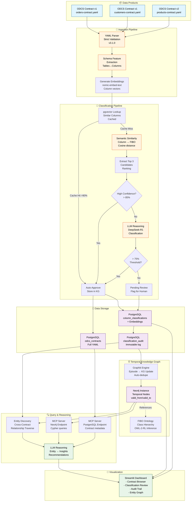
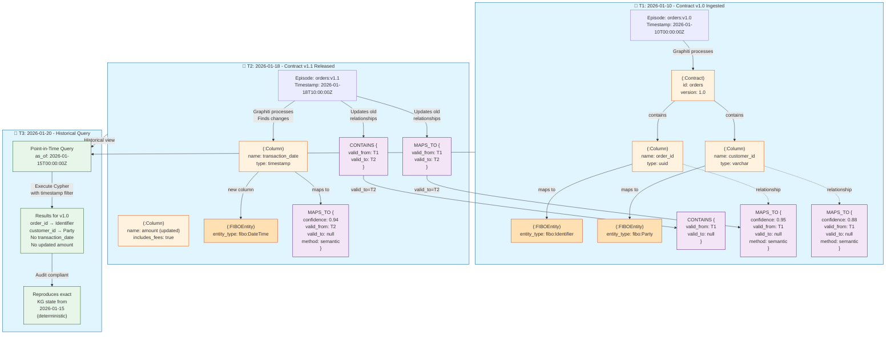
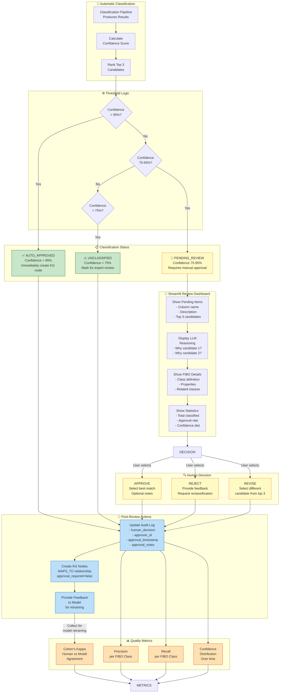
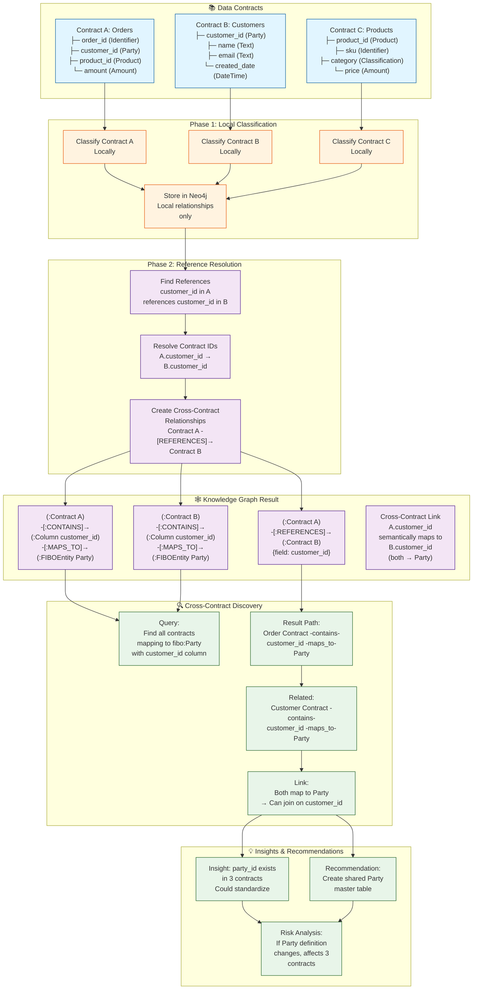
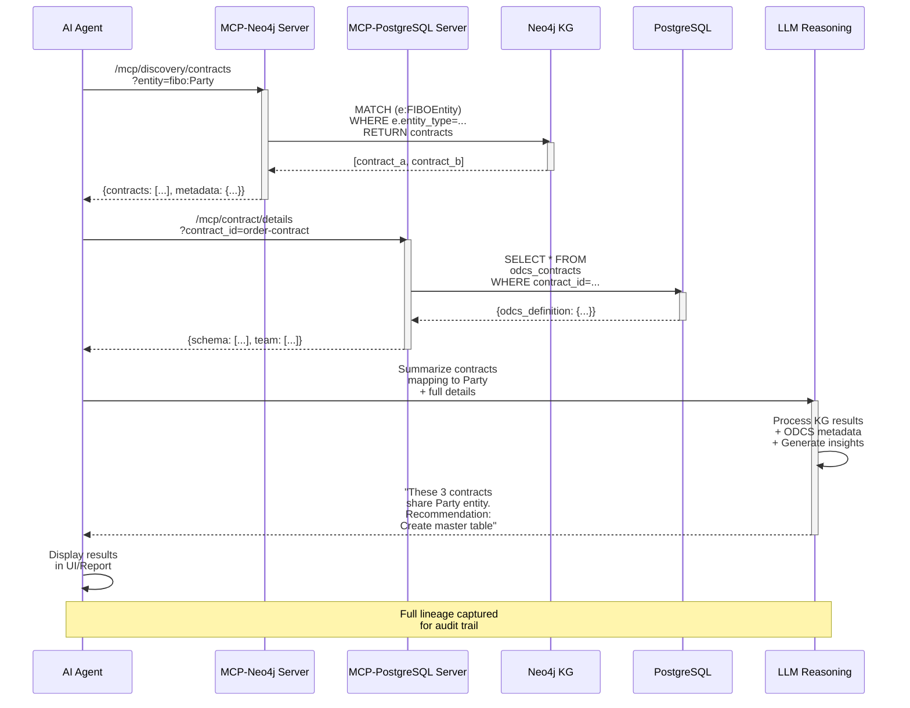
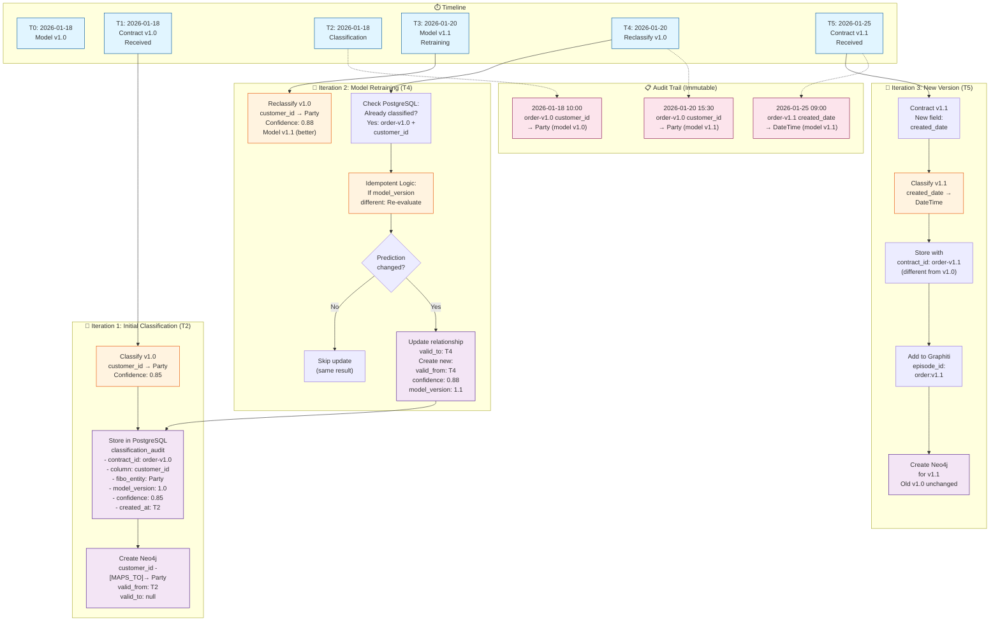

# ODCS + FIBO Knowledge Graph - Complete Mermaid Diagrams

## Diagram 1: System Architecture Overview



---

## Diagram 2: ODCS → FIBO Classification Pipeline (Detailed)

```mermaid
graph LR
    subgraph Input["📄 Input: ODCS Contract"]
        CONTRACT["Contract: orders-v1.0<br/>Domain: ecommerce<br/>Version: 1.0.0"]
        SCHEMA["Schema:<br/>├─ orders (table)<br/>├─ customers (table)<br/>└─ transactions (table)"]
        COLUMNS["Columns:<br/>├─ order_id (PK)<br/>├─ customer_id (FK)<br/>├─ amount<br/>├─ created_at<br/>└─ status"]
    end
    
    subgraph Preparation["🔧 Preparation"]
        VALIDATION["ODCS v3.1.0<br/>Strict Schema<br/>Validation"]
        TEXT_GEN["Generate Text<br/>Field name +<br/>Description"]
        EMBEDDING["Embed Columns<br/>nomic-embed-text<br/>768-dim vectors"]
    end
    
    subgraph Cache["⚡ Cache Check"]
        SIMILARITY["pgvector<br/>Cosine Similarity<br/>Search"]
        CACHED["Similar Column<br/>Already<br/>Classified?"]
        CACHED_HIGH{"Confidence<br/>> 90%?"}
    end
    
    subgraph SemanticPath["📊 Semantic Similarity Path"]
        FIBO_EMBED["FIBO Classes<br/>Pre-computed<br/>Embeddings"]
        COSINE["Cosine Similarity<br/>Column Vector →<br/>FIBO Vectors"]
        TOP3["Top 3<br/>Candidates<br/>Ranked"]
        CONF_CHECK{"Confidence<br/>> 85%?"}
    end
    
    subgraph LLMPath["🧠 LLM Reasoning Path"]
        PROMPT["Prompt Template<br/>Column name +<br/>Description +<br/>Candidates"]
        DEEPSEEK["DeepSeek-R1<br/>Financial<br/>Reasoning"]
        EXTRACT["Extract Choice<br/>+ Confidence<br/>+ Reasoning"]
    end
    
    subgraph Decision["🔀 Decision Logic"]
        CONF_THRESHOLD["Confidence<br/>Threshold<br/>Check"]
        STATUS{"Status<br/>Decision"}
        AUTO["AUTO_APPROVED<br/>Confidence > 75%"]
        REVIEW["PENDING_REVIEW<br/>Confidence 50-75%"]
        UNCLASS["UNCLASSIFIED<br/>Confidence < 50%"]
    end
    
    subgraph Output["✅ Output"]
        MAPPING["Relationship:<br/>Column → FIBO Entity<br/>Confidence: X"]
        AUDIT_LOG["Audit Log:<br/>decision_id<br/>fibo_entity<br/>confidence<br/>timestamp<br/>method"]
        KG_NODE["Create Neo4j<br/>MAPS_TO<br/>relationship"]
    end
    
    CONTRACT --> VALIDATION
    SCHEMA --> VALIDATION
    COLUMNS --> TEXT_GEN
    TEXT_GEN --> EMBEDDING
    VALIDATION --> EMBEDDING
    
    EMBEDDING --> SIMILARITY
    SIMILARITY --> CACHED
    CACHED -->|Yes| CACHED_HIGH
    CACHED -->|No| COSINE
    
    CACHED_HIGH -->|Yes| AUTO
    CACHED_HIGH -->|No| COSINE
    
    FIBO_EMBED --> COSINE
    COSINE --> TOP3
    TOP3 --> CONF_CHECK
    CONF_CHECK -->|Yes| AUTO
    CONF_CHECK -->|No| PROMPT
    
    COLUMNS --> PROMPT
    TOP3 --> PROMPT
    PROMPT --> DEEPSEEK
    DEEPSEEK --> EXTRACT
    EXTRACT --> CONF_THRESHOLD
    
    CONF_THRESHOLD --> STATUS
    STATUS -->|High| AUTO
    STATUS -->|Medium| REVIEW
    STATUS -->|Low| UNCLASS
    
    AUTO --> MAPPING
    REVIEW --> MAPPING
    UNCLASS --> MAPPING
    
    MAPPING --> AUDIT_LOG
    AUDIT_LOG --> KG_NODE
    AUDIT_LOG -->|Feedback| SIMILARITY
    
    classDef input fill:#e1f5ff,stroke:#01579b
    classDef prep fill:#fff3e0,stroke:#e65100
    classDef decision fill:#fce4ec,stroke:#880e4f
    classDef output fill:#e8f5e9,stroke:#1b5e20
    classDef process fill:#f3e5f5,stroke:#4a148c
    
    class CONTRACT,SCHEMA,COLUMNS input
    class VALIDATION,TEXT_GEN,EMBEDDING prep
    class CACHED,CONF_CHECK,STATUS decision
    class MAPPING,AUDIT_LOG,KG_NODE output
    class COSINE,DEEPSEEK,EXTRACT process
```



---

## Diagram 3: Temporal Knowledge Graph Evolution



---

## Diagram 4: Human-in-the-Loop Classification Review



---

## Diagram 5: Cross-Contract Discovery & Linking



---

## Diagram 6: MCP Server Query Flow



---

## Diagram 7: Idempotent Classification with Versioning



---

## Diagram 8: Conflict Resolution Scenarios

```mermaid
graph TB
    subgraph Scenario1["Scenario 1: Same Contract, Different Model Version"]
        S1_CURRENT["Current State:<br/>order-v1.0<br/>customer_id → Party (v1.0)"]
        S1_NEW["New Classification:<br/>Same contract<br/>customer_id → Party (v1.1)<br/>Confidence improved: 0.85→0.88"]
        S1_CHECK["Check: Already<br/>classified with<br/>model v1.0"]
        S1_DECIDE{"Confidence<br/>improved?"}
        S1_RESOLVE["✅ Update:<br/>Invalidate old<br/>Create new with v1.1"]
        S1_AUDIT["✅ Log:<br/>Reason: Model update<br/>v1.0 → v1.1"]
    end
    
    subgraph Scenario2["Scenario 2: Contract Version Conflict"]
        S2_A["Model run 1:<br/>order-v1.0<br/>customer_id →<br/>Party (0.85)"]
        S2_B["Model run 2:<br/>order-v1.0<br/>customer_id →<br/>PartyIdentifier (0.87)"]
        S2_CONFLICT["🚨 Conflict:<br/>Same contract version<br/>Different classification"]
        S2_FLAG["⚠️ Flag:<br/>Uncertainty in model<br/>Candidates too close"]
        S2_HUMAN["👤 Send to human:<br/>Decide: Party vs<br/>PartyIdentifier"]
    end
    
    subgraph Scenario3["Scenario 3: Late-Arriving Data"]
        S3_OLD["Classification created:<br/>2026-01-18 10:00<br/>order-v1.0<br/>customer_id → Party"]
        S3_BACKUP["Backup system sends<br/>old classification:<br/>2026-01-17 23:00<br/>order-v1.0<br/>customer_id → Party"]
        S3_TIMESTAMP["Check timestamp:<br/>Backup is OLDER<br/>(2026-01-17)"]
        S3_DISCARD["✅ Discard:<br/>Already have<br/>newer version"]
        S3_AUDIT_SKIP["✅ Log:<br/>Reason: Duplicate<br/>older timestamp"]
    end
    
    subgraph Scenario4["Scenario 4: Circular Dependencies"]
        S4_A["Contract A:<br/>references B"]
        S4_B["Contract B:<br/>references A"]
        S4_CYCLIC["🔄 Circular<br/>dependency<br/>detected"]
        S4_TWO_PASS["✅ Solution:<br/>Use two-pass approach<br/>Pass 1: Local classify<br/>Pass 2: Resolve refs"]
    end
    
    S1_CURRENT --> S1_CHECK
    S1_NEW --> S1_CHECK
    S1_CHECK --> S1_DECIDE
    S1_DECIDE -->|Yes| S1_RESOLVE
    S1_RESOLVE --> S1_AUDIT
    
    S2_A --> S2_CONFLICT
    S2_B --> S2_CONFLICT
    S2_CONFLICT --> S2_FLAG
    S2_FLAG --> S2_HUMAN
    
    S3_OLD --> S3_TIMESTAMP
    S3_BACKUP --> S3_TIMESTAMP
    S3_TIMESTAMP --> S3_DISCARD
    S3_DISCARD --> S3_AUDIT_SKIP
    
    S4_A --> S4_CYCLIC
    S4_B --> S4_CYCLIC
    S4_CYCLIC --> S4_TWO_PASS
    
    classDef resolved fill:#c8e6c9,stroke:#1b5e20
    classDef conflict fill:#ffcdd2,stroke:#b71c1c
    classDef human fill:#fff9c4,stroke:#f57f17
    classDef solution fill:#e0f2f1,stroke:#00695c
    
    class S1_RESOLVE,S1_AUDIT,S3_DISCARD,S3_AUDIT_SKIP resolved
    class S2_CONFLICT,S2_FLAG,S4_CYCLIC conflict
    class S2_HUMAN human
    class S4_TWO_PASS solution
```



---

## Diagram 9: Classification Model Training Loop

```mermaid
graph TB
    subgraph Bootstrap["🌱 Bootstrap Phase (Week 1)"]
        FIBO_DESC["Extract from FIBO<br/>RDF definitions<br/>rdfs:label<br/>rdfs:comment"]
        GEN_SYNTHETIC["Generate Synthetic<br/>Training Data<br/>Column name +<br/>Description"]
        LABEL_MANUAL["Manual Labeling<br/>20-30 expert hours<br/>500 examples<br/>10 per FIBO class"]
        INIT_MODEL["Train Seed Model<br/>sklearn/scikit<br/>With 500 labels"]
    end
    
    subgraph IterOne["🔄 Iteration 1 (Week 2-3)"]
        DEPLOY1["Deploy Model v1.0<br/>on 10 test<br/>contracts"]
        EVAL1["Evaluate Results<br/>Accuracy: 82%<br/>Need improvement"]
        SELECT_HARD["Select 100 'hard'<br/>examples<br/>Confidence 40-60%"]
        LABEL_ITER1["Expert labels<br/>100 examples<br/>5 hours"]
        RETRAIN1["Retrain Model v1.1<br/>With 600 labels"]
    end
    
    subgraph IterTwo["🔄 Iteration 2 (Week 4)"]
        DEPLOY2["Deploy Model v1.1<br/>Accuracy: 88%<br/>Getting closer"]
        SELECT_HARD2["Select 100 more<br/>'hard' examples"]
        LABEL_ITER2["Expert labels<br/>100 examples<br/>5 hours"]
        RETRAIN2["Retrain Model v1.2<br/>With 700 labels"]
    end
    
    subgraph IterThree["🔄 Iteration 3 (Week 5)"]
        DEPLOY3["Deploy Model v1.2<br/>Accuracy: 91%<br/>Target reached!"]
        METRIC_CHECK{"Metrics OK?<br/>Precision >85%<br/>Recall >80%?"}
        PLATEAU["Model plateau<br/>Accuracy plateauing<br/>→ diminishing returns"]
        FREEZE["Freeze Model v1.2<br/>Production ready"]
    end
    
    subgraph Maintenance["🔧 Ongoing Maintenance (Post-Launch)"]
        COLLECT["Collect feedback<br/>from human reviewers<br/>- Rejections<br/>- Revisions<br/>- High-confidence errors"]
        BATCH_RETRAIN["Monthly batch<br/>retraining<br/>Accumulated<br/>feedback"]
        ABLATION["Ablation study:<br/>Test on holdout<br/>contracts"]
        DEPLOY_NEXT["Deploy if<br/>accuracy improves<br/>v1.3, v1.4, ..."]
    end
    
    subgraph Metrics["📊 Tracking Metrics"]
        COHENS["Cohen's Kappa<br/>Human agreement"]
        PREC["Precision per<br/>FIBO class"]
        REC["Recall per<br/>FIBO class"]
        CONF_DIST["Confidence<br/>distribution"]
    end
    
    FIBO_DESC --> GEN_SYNTHETIC
    GEN_SYNTHETIC --> LABEL_MANUAL
    LABEL_MANUAL --> INIT_MODEL
    
    INIT_MODEL --> DEPLOY1
    DEPLOY1 --> EVAL1
    EVAL1 --> SELECT_HARD
    SELECT_HARD --> LABEL_ITER1
    LABEL_ITER1 --> RETRAIN1
    
    RETRAIN1 --> DEPLOY2
    DEPLOY2 --> SELECT_HARD2
    SELECT_HARD2 --> LABEL_ITER2
    LABEL_ITER2 --> RETRAIN2
    
    RETRAIN2 --> DEPLOY3
    DEPLOY3 --> METRIC_CHECK
    METRIC_CHECK -->|Yes| FREEZE
    METRIC_CHECK -->|No| PLATEAU
    PLATEAU --> FREEZE
    
    FREEZE --> COLLECT
    COLLECT --> BATCH_RETRAIN
    BATCH_RETRAIN --> ABLATION
    ABLATION --> DEPLOY_NEXT
    
    EVAL1 --> COHENS
    EVAL1 --> PREC
    EVAL1 --> REC
    EVAL1 --> CONF_DIST
    
    classDef init fill:#c8e6c9,stroke:#1b5e20
    classDef iter fill:#fff9c4,stroke:#f57f17
    classDef prod fill:#bbdefb,stroke:#1565c0
    classDef maint fill:#ffe0b2,stroke:#d84315
    classDef metric fill:#f0f4c3,stroke:#827717
    
    class FIBO_DESC,GEN_SYNTHETIC,LABEL_MANUAL,INIT_MODEL init
    class DEPLOY1,EVAL1,SELECT_HARD,LABEL_ITER1,RETRAIN1 iter
    class DEPLOY2,SELECT_HARD2,LABEL_ITER2,RETRAIN2 iter
    class DEPLOY3,METRIC_CHECK,PLATEAU,FREEZE prod
    class COLLECT,BATCH_RETRAIN,ABLATION,DEPLOY_NEXT maint
    class COHENS,PREC,REC,CONF_DIST metric
```



---

## Diagram 10: Complete Data Flow (End-to-End)

```mermaid
graph LR
    subgraph Source["📦 Source"]
        DATA_PROD["New Data<br/>Product<br/>Announced"]
    end
    
    subgraph Contract["📄 ODCS Contract"]
        WRITE_ODCS["Write ODCS<br/>v3.1.0<br/>Schema,<br/>Quality Rules"]
        VALIDATE["Validate<br/>Schema<br/>Strict Mode"]
    end
    
    subgraph Ingest["🔄 Ingestion"]
        PARSE_YAML["Parse YAML<br/>Extract schema<br/>Generate text"]
        TO_PG["Store in<br/>PostgreSQL<br/>odcs_contracts<br/>table"]
        EMBED["Embed columns<br/>nomic-embed-text<br/>pgvector"]
    end
    
    subgraph Classify["🤖 Classification"]
        CACHE_CHECK["Check pgvector<br/>Similar<br/>columns?"]
        SEMANTIC["Semantic<br/>Similarity<br/>to FIBO"]
        LLM["LLM<br/>Reasoning<br/>DeepSeek"]
        THRESHOLD["Apply<br/>Threshold<br/>Logic"]
        STORE_CLASS["Store in<br/>PostgreSQL<br/>classification_audit"]
    end
    
    subgraph KG["🕸️ Knowledge Graph"]
        GRAPHITI["Graphiti<br/>Add Episode<br/>temporal KG"]
        NEO["Neo4j<br/>Create nodes<br/>+ relationships"]
        FIBO["FIBO Ontology<br/>Reference"]
    end
    
    subgraph Query["🔍 Query"]
        DISC["Entity<br/>Discovery<br/>Cross-contract"]
        TRAVERSE["Graph<br/>Traversal<br/>Find links"]
        AGGREGATE["Aggregate<br/>Results"]
    end
    
    subgraph Reason["🧠 Reasoning"]
        LLM_REASON["LLM<br/>Synthesize<br/>Insights"]
        RECOMMEND["Generate<br/>Recommendations"]
    end
    
    subgraph Output["📤 Output"]
        DASHBOARD["Streamlit<br/>Dashboard"]
        API["MCP Server<br/>APIs"]
        REPORT["Audit Report<br/>Compliance"]
    end
    
    DATA_PROD --> WRITE_ODCS
    WRITE_ODCS --> VALIDATE
    VALIDATE --> PARSE_YAML
    
    PARSE_YAML --> TO_PG
    PARSE_YAML --> EMBED
    TO_PG --> CACHE_CHECK
    EMBED --> CACHE_CHECK
    
    CACHE_CHECK --> SEMANTIC
    SEMANTIC --> LLM
    LLM --> THRESHOLD
    THRESHOLD --> STORE_CLASS
    
    STORE_CLASS --> GRAPHITI
    GRAPHITI --> NEO
    NEO -.->|Reference| FIBO
    
    NEO --> DISC
    STORE_CLASS --> DISC
    DISC --> TRAVERSE
    TRAVERSE --> AGGREGATE
    
    AGGREGATE --> LLM_REASON
    LLM_REASON --> RECOMMEND
    
    RECOMMEND --> DASHBOARD
    RECOMMEND --> API
    STORE_CLASS --> REPORT
    
    classDef external fill:#e1f5ff,stroke:#01579b
    classDef local fill:#fff3e0,stroke:#e65100
    classDef ML fill:#fce4ec,stroke:#880e4f
    classDef graph fill:#f3e5f5,stroke:#4a148c
    classDef ui fill:#e8f5e9,stroke:#1b5e20
    
    class DATA_PROD external
    class WRITE_ODCS,VALIDATE,PARSE_YAML,TO_PG,EMBED local
    class CACHE_CHECK,SEMANTIC,LLM,THRESHOLD,STORE_CLASS ML
    class GRAPHITI,NEO,FIBO,DISC,TRAVERSE,AGGREGATE graph
    class LLM_REASON,RECOMMEND,DASHBOARD,API,REPORT ui
```

---

**All diagrams created with Mermaid syntax. Copy-paste into any Mermaid renderer (mermaid.live, GitHub Markdown, GitLab, etc.) for visualization.**
