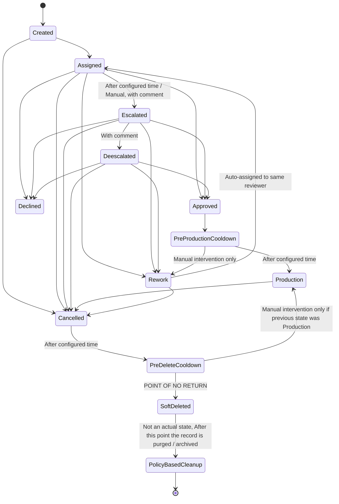

# Workflow Documentation

## Workflow States

### Created
The initial state where the request has been created. It allows for further actions such as assignment or cancellation.

### SoftDeleted
Represents the state where the request is marked for soft deletion. This is a critical point as it signifies that the record is prepared for eventual deletion from the database and may be archived according to business policies, notably indicated by the pseudo-state "PolicyBasedCleanup."

### Assigned
In this state, a reviewer is assigned to evaluate the request. It serves as a transitional phase where the assigned reviewer can take actions such as escalating, approving, declining, or marking the request for rework.

### Escalated
This state indicates that the request has been escalated either manually by the reviewer or automatically after a predefined time period. It requires the addition of a comment to explain the escalation.

### Deescalated
Deescalation can only occur from the "Escalated" state, and it similarly necessitates a comment. This state allows for reassessment of the request after escalation.

### Approved
The request has been successfully approved. This state leads to a cooldown period before transitioning to production.

### Declined
Indicates that the request has been declined, which requires a comment to justify the decision.

### PreProductionCooldown
During this cooldown phase, no other actions are permissible, except for manual intervention that can revert the request back to the "Rework" state. Once the configured duration elapses, the workflow automatically transitions to the "Production" state, and no further reversion is allowed after this point.

### PreDeleteCooldown
Similar to the pre-production cooldown, this state disallows any actions during its duration, with the exception of manual intervention that can revert to the "Production" state only if the previous state was "Production." After the set time, it transitions the request to "SoftDeleted," and no further reversion is allowed once the transition occurs.

### Production
In this state, the request is in active production. The only possible next action is cancellation.

### Rework
This state indicates that the request requires further action from the requester, typically due to identified issues. It mandates a comment from the reviewer and is automatically reassigned to the same reviewer upon entry.

### Cancelled
A request can be cancelled at any point unless it is already in the "SoftDeleted" or "Declined" states. This state transitions to the "PreDeleteCooldown."

### SoftDeleted
Once in this state, the record is marked for purging or archiving. This signifies the end of the active workflow process.

### PolicyBasedCleanup
This is not an actual workflow state but represents the eventual purging or archiving of the soft-deleted records based on business policies.

## Workflow Process Overview

The workflow operates through the following key components:

- **Workflow Submission**: The workflow is initiated by submitting the workflow file to the service via a designated endpoint, establishing the necessary context for the approval process.

- **Task Creation**: Once a catalogue or job is created, a message is dispatched to a Kafka topic, defaulting the state to "Created" within the service.

- **State Management**: The BPM service processes incoming messages and allows users to assign tasks to reviewers, either automatically or manually.

- **Review Process**: Assigned users review the catalogue or job and decide on actions: approve, decline, or return it for rework, providing a comment when necessary.

- **Escalation**: In the absence of reviewer action within a configurable timeframe, the request is escalated. Deescalation is permissible only when the request is in the "Escalated" state, with a required comment.

- **State Updates**: Relevant state changes are communicated through messages sent to a Kafka topic, including the catalogue or job ID and current status for interested parties to process.

- **Cooldown and Production States**: Upon approval, the request enters a cooldown period during which it can be manually reverted before transitioning to the "Production" state.

## Input Variables

- **nextState**: Indicates the upcoming state transition for the request.

- **PreDeleteCooldownSeconds**: Duration for the pre-delete cooldown state, after which the request will be soft-deleted.

- **PreProductionCooldownSeconds**: Duration for the pre-production cooldown state, after which the request transitions to production.

- **AutoEscalationTimeInSeconds**: Time period after which the request will be automatically escalated if there is no response.

## Personas Involved

- **Requester**: Initiates the request and can cancel it at any time unless in a restricted state.

- **Approver**: Reviews the request and can approve, decline, escalate, or return the request for rework.

- **Escalator**: Responsible for triggering escalations based on predefined timelines.

- **Admin**: Installs the workflow file, ensuring that each workflow caters to a specific approval process, such as:
  - Entity Catalogue (identified by `<process id= ...>` as entity)
  - Job Catalogue (identified by `<process id= ...>` as job)
