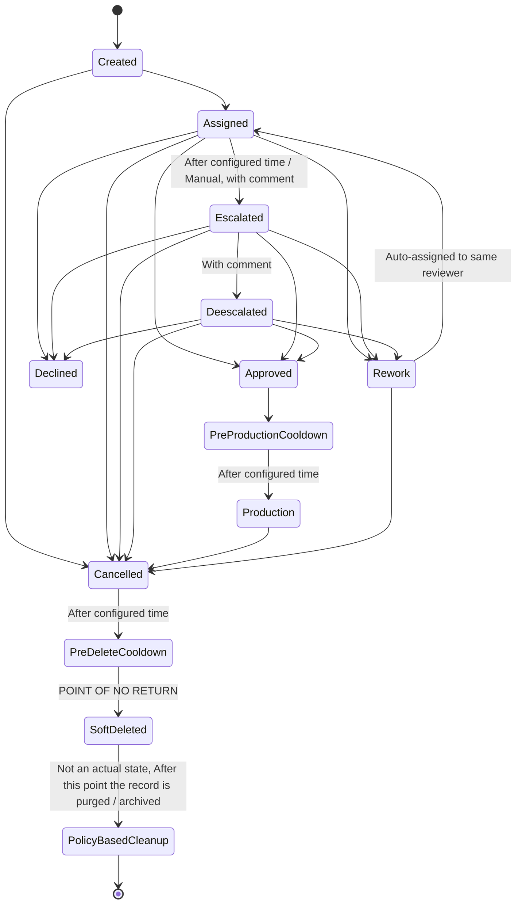

# Workflow States



## Descriptions  

+ Created: The request has been created.
+ SoftDeleted: The request is soft deleted. This is a point of no return state. This state means that the record would be ready for deletion from the DB and may be archived based on the policy depected by the sudo state "PolicyBasedCleanup'
+ Assigned: A reviewer is assigned to the request.
+ Escalated: The request is escalated either manually by the user or automatically after a configured time period if the request is in “Assigned” state. Escalation requires a comment.
+ Deescalated: The request is deescalated, which can only occur if the request is in the “Escalated” state. Deescalation requires a comment.
+ Approved: The request has been approved.
+ Declined: The request is declined with a comment.
+ PreProductionCooldown: No other action is possible during this time period. After the configured time period, the request moves to the “Production” state.
+ PreDeleteCooldown: No other action is possible during this time period. After the configured time period, the request moves to the “SoftDeleted”. 
+ Production: The request is in production. The next possible states are “Cancelled”.
+ Rework: This state requires a comment and indicates that there is an action item pending on the requester. The next possible state is “Created” and it is auto-assigned to the same person who was reviewing it.
+ Cancelled: Can be requested by the end user at any point unless it is “Deleted” or “Declined”.

## Workflow Process  

+ Workflow Submission: The workflow file is submitted to the service via an endpoint. Any new flow will start using this workflow.
+ Task Creation: Once a catalogue / job is created by a service, it will push a message to a Kafka topic. The state of the catalogue will be “Created” by default on the service side.
+ State Management: The BPM service will read the message and allow the user to assign it to a reviewer either automatically or manually.
+ Review Process: The assigned user will check the catalogue / Job and either approve, decline, or change the status to “Rework” with a comment.
+ Escalation: If there is no response within a configurable time period, the request will be escalated. It can be deescalated only if the request is in “Escalated” state with a appropriate comment.
+ State Updates: A message will be sent to a Kafka topic with the catalogue/jOb ID, current status, and any other relevant information to which the originating requester services would listen to and change the corresponding state.
+ Cooldown and Production States: Once the request is approved, the state changes to “Cooldown” for a configured time, then automatically moves to the “Production” state.
+ Notifications: Alerts will be sent to the user, reviewer, and/or the mailing/subscriber list via appropriate channels for intimation. The notification details would be part of the request payload
+ Audit: Each state change would create am audit event for storage in the audit logs via the audit service. 
+ REST endpoints: Some of the state related help information would be exposed as a REST endpoints for transparency

```xml
<?xml version="1.0" encoding="UTF-8"?>
<definitions xmlns="http://www.omg.org/spec/BPMN/20100524/MODEL"
             xmlns:xsi="http://www.w3.org/2001/XMLSchema-instance"
             xsi:schemaLocation="http://www.omg.org/spec/BPMN/20100524/MODEL
                    http://www.omg.org/spec/BPMN/2.0/20100501/BPMN20.xsd"
             xmlns:activiti="http://activiti.org/bpmn"
             targetNamespace="Examples">
    <process id="entity" name="workflow process for entity" isExecutable="true">

        <!-- Start Event -->
        <startEvent id="startEvent" name="Start" activiti:initiator="initiator"/>
        <sequenceFlow id="flow1" sourceRef="startEvent" targetRef="createdState"/>

        <!-- Created State -->
        <userTask id="createdState" name="Created" activiti:assignee="${assignee}"/>
        <serviceTask id="auditCreatedState" name="Audit Created State" activiti:class="com.lbg.foundation.workflow.service.AuditService"/>
        <sequenceFlow id="flowAudit1" sourceRef="createdState" targetRef="auditCreatedState"/>
        <sequenceFlow id="flow2" sourceRef="auditCreatedState" targetRef="assignedState"/>

        <!-- Assigned State -->
        <userTask id="assignedState" name="Assigned" activiti:assignee="reviewer"/>
        <serviceTask id="auditAssignedState" name="Audit Assigned State" activiti:class="com.lbg.foundation.workflow.service.AuditService"/>
        <sequenceFlow id="flowAudit2" sourceRef="assignedState" targetRef="auditAssignedState"/>
        <sequenceFlow id="flow3" sourceRef="auditAssignedState" targetRef="reassignedState"/>
        <sequenceFlow id="flow4" sourceRef="auditAssignedState" targetRef="escalatedState"/>
        <sequenceFlow id="flow5" sourceRef="auditAssignedState" targetRef="approvedState"/>
        <sequenceFlow id="flow6" sourceRef="auditAssignedState" targetRef="declinedState"/>
        <sequenceFlow id="flow7" sourceRef="auditAssignedState" targetRef="reworkState"/>
        <sequenceFlow id="flow8" sourceRef="auditAssignedState" targetRef="cancelledState"/>

        <!-- Reassigned State -->
        <userTask id="reassignedState" name="Reassigned" activiti:assignee="newReviewer"/>
        <serviceTask id="auditReassignedState" name="Audit Reassigned State" activiti:class="com.lbg.foundation.workflow.service.AuditService"/>
        <sequenceFlow id="flowAudit3" sourceRef="reassignedState" targetRef="auditReassignedState"/>
        <sequenceFlow id="flow9" sourceRef="auditReassignedState" targetRef="escalatedState"/>
        <sequenceFlow id="flow10" sourceRef="auditReassignedState" targetRef="approvedState"/>
        <sequenceFlow id="flow11" sourceRef="auditReassignedState" targetRef="declinedState"/>
        <sequenceFlow id="flow12" sourceRef="auditReassignedState" targetRef="reworkState"/>
        <sequenceFlow id="flow13" sourceRef="auditReassignedState" targetRef="cancelledState"/>

        <!-- Escalated State -->
        <userTask id="escalatedState" name="Escalated" activiti:assignee="escalator"/>
        <serviceTask id="auditEscalatedState" name="Audit Escalated State" activiti:class="com.lbg.foundation.workflow.service.AuditService"/>
        <sequenceFlow id="flowAudit4" sourceRef="escalatedState" targetRef="auditEscalatedState"/>
        <sequenceFlow id="flow14" sourceRef="auditEscalatedState" targetRef="deescalatedState"/>
        <sequenceFlow id="flow15" sourceRef="auditEscalatedState" targetRef="approvedState"/>
        <sequenceFlow id="flow16" sourceRef="auditEscalatedState" targetRef="declinedState"/>
        <sequenceFlow id="flow17" sourceRef="auditEscalatedState" targetRef="reworkState"/>
        <sequenceFlow id="flow18" sourceRef="auditEscalatedState" targetRef="cancelledState"/>

        <!-- Deescalated State -->
        <userTask id="deescalatedState" name="Deescalated" activiti:assignee="escalator"/>
        <serviceTask id="auditDeescalatedState" name="Audit Deescalated State"
                     activiti:class="com.lbg.foundation.workflow.service.AuditService"/>
        <sequenceFlow id="flowAudit5" sourceRef="deescalatedState" targetRef="auditDeescalatedState"/>
        <sequenceFlow id="flow19" sourceRef="auditDeescalatedState" targetRef="approvedState"/>
        <sequenceFlow id="flow20" sourceRef="auditDeescalatedState" targetRef="declinedState"/>
        <sequenceFlow id="flow21" sourceRef="auditDeescalatedState" targetRef="reworkState"/>
        <sequenceFlow id="flow22" sourceRef="auditDeescalatedState" targetRef="cancelledState"/>

        <!-- Approved State -->
        <userTask id="approvedState" name="Approved" activiti:assignee="approver"/>
        <serviceTask id="auditApprovedState" name="Audit Approved State" activiti:class="com.lbg.foundation.workflow.service.AuditService"/>
        <sequenceFlow id="flowAudit6" sourceRef="approvedState" targetRef="auditApprovedState"/>
        <sequenceFlow id="flow23" sourceRef="auditApprovedState" targetRef="preProductionCooldownState"/>

        <!-- PreProductionCooldown State  -->
        <userTask id="preProductionCooldownState" name="PreProductionCooldown" activiti:async="true"/>
        <serviceTask id="auditPreProductionCooldownState" name="Audit Pre-Production Cooldown State"
                     activiti:class="com.lbg.foundation.workflow.service.AuditService"/>
        <sequenceFlow id="flowAudit7" sourceRef="preProductionCooldownState"
                      targetRef="auditPreProductionCooldownState"/>

        <!-- Pre-Production Notification -->
        <intermediateCatchEvent id="preProductionNotification">
            <timerEventDefinition>
                <timeDuration>${preProductionWarningTimeout}</timeDuration>
            </timerEventDefinition>
        </intermediateCatchEvent>
        <serviceTask id="preProductionNotify" name="Notify Pre-Production Timeout"
                     activiti:class="com.lbg.foundation.workflow.service.NotificationService"/>
        <sequenceFlow id="flow_preProdNotify" sourceRef="preProductionNotification" targetRef="preProductionNotify"/>

        <!-- User Override Option for Pre-Production -->
        <userTask id="preProductionOverride" name="Override Pre-Production Timeout" activiti:assignee="requester"/>
        <sequenceFlow id="flow_preProdOverride" sourceRef="preProductionNotify" targetRef="preProductionOverride"/>
        <sequenceFlow id="flow_preProdNext" sourceRef="preProductionOverride" targetRef="productionState"/>

        <boundaryEvent id="preProductionTimeoutEvent" attachedToRef="preProductionCooldownState" cancelActivity="true">
            <timerEventDefinition>
                <timeDuration>${preProductionTimeout}</timeDuration>
            </timerEventDefinition>
        </boundaryEvent>
        <sequenceFlow id="flow24" sourceRef="auditPreProductionCooldownState" targetRef="productionState"/>
        <sequenceFlow id="flow_timeout_to_prod" sourceRef="preProductionTimeoutEvent" targetRef="productionState"/>

        <!-- Production State -->
        <userTask id="productionState" name="Production"/>
        <serviceTask id="auditProductionState" name="Audit Production State" activiti:class="com.lbg.foundation.workflow.service.AuditService"/>
        <sequenceFlow id="flowAudit8" sourceRef="productionState" targetRef="auditProductionState"/>

        <!-- Production Notification -->
        <intermediateCatchEvent id="productionNotification">
            <timerEventDefinition>
                <timeDuration>${productionWarningTimeout}</timeDuration>
            </timerEventDefinition>
        </intermediateCatchEvent>
        <serviceTask id="productionNotify" name="Notify Production Timeout"
                     activiti:class="com.lbg.foundation.workflow.service.NotificationService"/>
        <sequenceFlow id="flow_prodNotify" sourceRef="productionNotification" targetRef="productionNotify"/>

        <!-- User Override Option for Production -->
        <userTask id="productionOverride" name="Override Production Timeout" activiti:assignee="requester"/>
        <sequenceFlow id="flow_prodOverride" sourceRef="productionNotify" targetRef="productionOverride"/>
        <sequenceFlow id="flow_prodNext" sourceRef="productionOverride" targetRef="cancelledState"/>

        <boundaryEvent id="productionTimeoutEvent" attachedToRef="productionState" cancelActivity="true">
            <timerEventDefinition>
                <timeDuration>${productionTimeout}</timeDuration>
            </timerEventDefinition>
        </boundaryEvent>
        <sequenceFlow id="flow25" sourceRef="auditProductionState" targetRef="cancelledState"/>
        <sequenceFlow id="flow_timeout_to_cancel" sourceRef="productionTimeoutEvent" targetRef="cancelledState"/>

        <!-- Rework State -->
        <userTask id="reworkState" name="Rework" activiti:assignee="reviewer"/>
        <serviceTask id="auditReworkState" name="Audit Rework State" activiti:class="com.lbg.foundation.workflow.service.AuditService"/>
        <sequenceFlow id="flowAudit9" sourceRef="reworkState" targetRef="auditReworkState"/>
        <sequenceFlow id="flow26" sourceRef="auditReworkState" targetRef="productionState"/>

        <!-- Declined State -->
        <userTask id="declinedState" name="Declined" activiti:assignee="approver"/>
        <serviceTask id="auditDeclinedState" name="Audit Declined State" activiti:class="com.lbg.foundation.workflow.service.AuditService"/>
        <sequenceFlow id="flowAudit10" sourceRef="declinedState" targetRef="auditDeclinedState"/>
        <sequenceFlow id="flow27" sourceRef="auditDeclinedState" targetRef="cancelledState"/>

        <!-- Cancelled State -->
        <userTask id="cancelledState" name="Cancelled"/>
        <serviceTask id="auditCancelledState" name="Audit Cancelled State" activiti:class="com.lbg.foundation.workflow.service.AuditService"/>
        <sequenceFlow id="flowAudit11" sourceRef="cancelledState" targetRef="auditCancelledState"/>
        <sequenceFlow id="flow28" sourceRef="auditCancelledState" targetRef="softDeletedState"/>

        <!-- SoftDeleted State -->
        <userTask id="softDeletedState" name="SoftDeleted"/>
        <serviceTask id="auditSoftDeletedState" name="Audit SoftDeleted State"
                     activiti:class="com.lbg.foundation.workflow.service.AuditService"/>
        <sequenceFlow id="flowAudit12" sourceRef="softDeletedState" targetRef="auditSoftDeletedState"/>
        <sequenceFlow id="flow29" sourceRef="auditSoftDeletedState" targetRef="endEvent"/>

        <!-- PolicyBasedCleanup (Final Step for Archiving) -->
        <!--        <serviceTask id="policyBasedCleanupState" name="PolicyBasedCleanup"/>-->
        <!--        <serviceTask id="auditPolicyBasedCleanupState" name="Audit PolicyBasedCleanup State"-->
        <!--                     activiti:class="com.lbg.foundation.workflow.service.AuditService"/>-->
        <!--        <sequenceFlow id="flow30" sourceRef="policyBasedCleanupState" targetRef="auditPolicyBasedCleanupState"/>-->
        <!--        <sequenceFlow id="flow31" sourceRef="auditPolicyBasedCleanupState" targetRef="endEvent"/>-->

        <!-- End Event -->
        <endEvent id="endEvent" name="End"/>

    </process>
</definitions>

        <!-- FIXME : activiti:async="true" so that recovery is possible -->
```

```java
package com.lbg.foundation.workflow.constants;

import io.swagger.v3.oas.annotations.media.Schema;

@Schema(description = "Interface representing the allowed variables in the Workflow file")
public interface ProcessVariables {

    @Schema(description = "The unique request based correlation ID for each task")
    String CORRELATION_ID = "correlationId";

    @Schema(description = "The Comment for the Task of the workflow")
    String COMMENT= "comment";

    @Schema(description = "The ID of the person who submitted the task for approval")
    String WORKFLOW_OWNER = "owner";

    @Schema(description = "The unique job ID for approval if TASK_TYPE is JOB")
    String JOB_ID = "job_Id";

    @Schema(description = "The unique Consumer ID if the TASK_TYPE is CATALOGUE and ENTITY_TYPE is CONSUMER")
    String CONSUMER_ID = "consumer_id";

    @Schema(description = "The unique Producer ID if the TASK_TYPE is CATALOGUE and ENTITY_TYPE is PRODUCER")
    String PRODUCER_ID = "producer_id";

    @Schema(description = "The status of the approval TASK")
    String STATUS = "status";

    @Schema(description = "TASK_TYPE can be JOB or CATALOGUE")
    String TASK_TYPE = "task_type";

    @Schema(description = "ENTITY_TYPE can be PRODUCER or CATALOGUE")
    String ENTITY_TYPE = "entity_type";

    @Schema(description = "The ID of Entity")
    String ENTITY_ID = "entity_id";

    @Schema(description = "The status of the approval task indicating if it is escalated")
    String ESCALATED = "escalated";

    @Schema(description = "The Unique ID auto generated when the approval task is first submitted")
    String EVENT_ID = "event_id";
}
```
```xml
<?xml version="1.0" encoding="UTF-8"?>
<definitions xmlns="http://www.omg.org/spec/BPMN/20100524/MODEL" 
             xmlns:xsi="http://www.w3.org/2001/XMLSchema-instance"
             xmlns:bpmndi="http://www.omg.org/spec/BPMN/20100524/DI"
             xmlns:omgdc="http://www.omg.org/spec/DD/20100524/DC"
             xmlns:omgdi="http://www.omg.org/spec/DD/20100524/DI"
             xmlns:activiti="http://activiti.org/bpmn"
             targetNamespace="http://www.example.com/workflow">

    <process id="approvalWorkflow" name="Approval Workflow" isExecutable="true">

        <!-- Initial Start Event -->
        <startEvent id="startEvent" name="Request Created">
            <outgoing>flow_to_Created</outgoing>
        </startEvent>

        <sequenceFlow id="flow_to_Created" sourceRef="startEvent" targetRef="createdState"/>

        <!-- Created State -->
        <userTask id="createdState" name="Request Created">
            <outgoing>flow_Created_to_decision</outgoing>
        </userTask>

        <sequenceFlow id="flow_Created_to_decision" sourceRef="createdState" targetRef="gateway_Created_decision"/>

        <exclusiveGateway id="gateway_Created_decision" name="Decision after Creation">
            <incoming>flow_Created_to_decision</incoming>
            <outgoing>flow_Created_to_Assigned</outgoing>
            <outgoing>flow_Created_to_Cancelled</outgoing>
        </exclusiveGateway>

        <sequenceFlow id="flow_Created_to_Assigned" sourceRef="gateway_Created_decision" targetRef="assignedState">
            <conditionExpression xsi:type="tFormalExpression">${nextState == 'Assigned'}</conditionExpression>
        </sequenceFlow>
        
        <sequenceFlow id="flow_Created_to_Cancelled" sourceRef="gateway_Created_decision" targetRef="cancelledState">
            <conditionExpression xsi:type="tFormalExpression">${nextState == 'Cancelled'}</conditionExpression>
        </sequenceFlow>

        <!-- Assigned State with Escalation Timer -->
        <userTask id="assignedState" name="Request Assigned">
            <incoming>flow_Created_to_Assigned</incoming>
            <outgoing>flow_Assigned_to_decision</outgoing>
        </userTask>

        <boundaryEvent id="escalationTimer" attachedToRef="assignedState" cancelActivity="true">
            <timerEventDefinition>
                <timeDuration>PT1H</timeDuration> <!-- Example: escalation after 1 hour -->
            </timerEventDefinition>
            <outgoing>flow_Assigned_to_Escalated</outgoing>
        </boundaryEvent>

        <sequenceFlow id="flow_Assigned_to_Escalated" sourceRef="escalationTimer" targetRef="escalatedState"/>

        <sequenceFlow id="flow_Assigned_to_decision" sourceRef="assignedState" targetRef="gateway_Assigned_decision"/>

        <exclusiveGateway id="gateway_Assigned_decision" name="Decision in Assigned">
            <incoming>flow_Assigned_to_decision</incoming>
            <outgoing>flow_Assigned_to_Approved</outgoing>
            <outgoing>flow_Assigned_to_Declined</outgoing>
            <outgoing>flow_Assigned_to_Rework</outgoing>
            <outgoing>flow_Assigned_to_Cancelled</outgoing>
        </exclusiveGateway>

        <sequenceFlow id="flow_Assigned_to_Approved" sourceRef="gateway_Assigned_decision" targetRef="approvedState">
            <conditionExpression xsi:type="tFormalExpression">${nextState == 'Approved'}</conditionExpression>
        </sequenceFlow>

        <sequenceFlow id="flow_Assigned_to_Declined" sourceRef="gateway_Assigned_decision" targetRef="declinedState">
            <conditionExpression xsi:type="tFormalExpression">${nextState == 'Declined'}</conditionExpression>
        </sequenceFlow>

        <sequenceFlow id="flow_Assigned_to_Rework" sourceRef="gateway_Assigned_decision" targetRef="reworkState">
            <conditionExpression xsi:type="tFormalExpression">${nextState == 'Rework'}</conditionExpression>
        </sequenceFlow>

        <sequenceFlow id="flow_Assigned_to_Cancelled" sourceRef="gateway_Assigned_decision" targetRef="cancelledState">
            <conditionExpression xsi:type="tFormalExpression">${nextState == 'Cancelled'}</conditionExpression>
        </sequenceFlow>

        <!-- Escalated State -->
        <userTask id="escalatedState" name="Request Escalated">
            <incoming>flow_Assigned_to_Escalated</incoming>
            <outgoing>flow_Escalated_to_decision</outgoing>
        </userTask>

        <sequenceFlow id="flow_Escalated_to_decision" sourceRef="escalatedState" targetRef="gateway_Escalated_decision"/>

        <exclusiveGateway id="gateway_Escalated_decision" name="Decision in Escalated">
            <incoming>flow_Escalated_to_decision</incoming>
            <outgoing>flow_Escalated_to_Approved</outgoing>
            <outgoing>flow_Escalated_to_Declined</outgoing>
            <outgoing>flow_Escalated_to_Rework</outgoing>
            <outgoing>flow_Escalated_to_Cancelled</outgoing>
        </exclusiveGateway>

        <sequenceFlow id="flow_Escalated_to_Approved" sourceRef="gateway_Escalated_decision" targetRef="approvedState">
            <conditionExpression xsi:type="tFormalExpression">${nextState == 'Approved'}</conditionExpression>
        </sequenceFlow>

        <sequenceFlow id="flow_Escalated_to_Declined" sourceRef="gateway_Escalated_decision" targetRef="declinedState">
            <conditionExpression xsi:type="tFormalExpression">${nextState == 'Declined'}</conditionExpression>
        </sequenceFlow>

        <sequenceFlow id="flow_Escalated_to_Rework" sourceRef="gateway_Escalated_decision" targetRef="reworkState">
            <conditionExpression xsi:type="tFormalExpression">${nextState == 'Rework'}</conditionExpression>
        </sequenceFlow>

        <sequenceFlow id="flow_Escalated_to_Cancelled" sourceRef="gateway_Escalated_decision" targetRef="cancelledState">
            <conditionExpression xsi:type="tFormalExpression">${nextState == 'Cancelled'}</conditionExpression>
        </sequenceFlow>

        <!-- Approved State -->
        <userTask id="approvedState" name="Request Approved">
            <incoming>flow_Assigned_to_Approved</incoming>
            <incoming>flow_Escalated_to_Approved</incoming>
            <outgoing>flow_Approved_to_Cooldown</outgoing>
        </userTask>

        <sequenceFlow id="flow_Approved_to_Cooldown" sourceRef="approvedState" targetRef="preProductionCooldownState"/>

        <!-- Pre-Production Cooldown -->
        <userTask id="preProductionCooldownState" name="Pre-Production Cooldown">
            <incoming>flow_Approved_to_Cooldown</incoming>
            <outgoing>flow_Cooldown_to_Production</outgoing>
        </userTask>

        <boundaryEvent id="preProductionTimer" attachedToRef="preProductionCooldownState" cancelActivity="true">
            <timerEventDefinition>
                <timeDuration>PT24H</timeDuration> <!-- Cooldown duration of 24 hours -->
            </timerEventDefinition>
            <outgoing>flow_Cooldown_to_Production</outgoing>
        </boundaryEvent>

        <sequenceFlow id="flow_Cooldown_to_Production" sourceRef="preProductionTimer" targetRef="productionState"/>

        <!-- Production State -->
        <userTask id="productionState" name="In Production">
            <incoming>flow_Cooldown_to_Production</incoming>
            <outgoing>flow_Production_to_Cancelled</outgoing>
        </userTask>

        <sequenceFlow id="flow_Production_to_Cancelled" sourceRef="productionState" targetRef="cancelledState">
            <conditionExpression xsi:type="tFormalExpression">${nextState == 'Cancelled'}</conditionExpression>
        </sequenceFlow>

        <!-- Rework State -->
        <userTask id="reworkState" name="Request in Rework">
            <incoming>flow_Assigned_to_Rework</incoming>
            <incoming>flow_Escalated_to_Rework</incoming>
            <outgoing>flow_Rework_to_Assigned</outgoing>
        </userTask>

        <sequenceFlow id="flow_Rework_to_Assigned" sourceRef="reworkState" targetRef="assignedState"/>

        <!-- Cancelled State -->
        <userTask id="cancelledState" name="Request Cancelled">
            <incoming>flow_Created_to_Cancelled</incoming>
            <incoming>flow_Assigned_to_Cancelled</incoming>
            <incoming>flow_Escalated_to_Cancelled</incoming>
            <outgoing>flow_Cancelled_to_PreDelete</outgoing>
        </userTask>

        <!-- Pre-Delete Cooldown State -->
        <userTask id="preDeleteCooldownState" name="Pre-Delete Cooldown">
            <incoming>flow_Cancelled_to_PreDelete</incoming>
        </userTask>

    </process>

</definitions>

```
